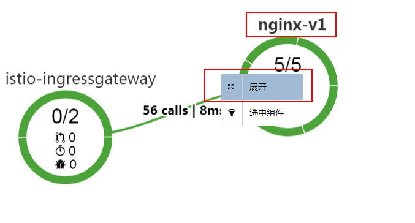

# 流量治理

通过修改负载均衡方式，进行故障注入测试及配置基本连接池管理。

## 配置流量策略

1.  登录[应用服务网格控制台](https://console.huaweicloud.com/istio/)，在左侧导航栏中选择“流量治理“。
2.  选择组件所在的集群、命名空间和应用，如无所属应用选择未配置。
3.  在拓扑图中，单击组件名称下的圆形图标。在负载均衡算法中，进行流量策略配置。
    -   **负载均衡算法**
        -   ROUND\_ROBIN：轮询，默认负载均衡算法。
        -   LEAST\_CONN：随机选取两个健康的主机，再从所选取的两个主机中选择一个链接数较少的主机。
        -   RANDOM：从所有健康的主机中，随机选取一个。

    -   **会话保持**
        -   根据HTTP header中的内容获取哈希：
            -   选择Cookie：将以HTTP请求中的所有Cookie计算哈希，哈希相同的请求将会转发至同一个实例进行处理。
            -   选择User-Agent：将以HTTP请求中的User\_agent来计算哈希，UA哈希值相同的请求将会转发至同一个实例进行处理。
            -   流量治理也支持用户使用自定义Key来计算哈希，只需选择自定义模式并且输入键的名称。

        -   根据Cookie中的内容获取哈希：支持用户输入Cookie键的名称，转发方式则由设定的Cookie键对应的值来计算哈希，哈希相同的请求则会转发至同一个实例中。例如我们设定Cookie中的User为键，则通过计算User对应的值的哈希来确认转发规则。
        -   根据Sourcelp中的内容获取哈希：流量将会按照请求源IP地址的哈希值进行会话保持。

4.  连接池管理。
    -   **最大连接数**

        到目标主机HTTP1或TCP连接的最大数量。

    -   **最大请求重试次数**

        在指定时间内对目标主机最大重试次数。

    -   **最大等待请求数**

        等待列队的长度，默认为1024。

    -   **每连接最大请求数**

        对后端连接中最大的请求数量若设为1则会禁止keep alive特性。

    -   **连接超时时间**

        TCP连接超时时间。

    -   **最大请求数**

        后端服务处理的最大请求数，默认为1024。

5.  熔断配置。在流量策略中选择进行熔断策略配置。
    -   **连续错误数**

        在一个检查周期内，连续出现500及以上错误的个数，例502、503状态码。

    -   **检查周期**

        将会对检查周期内的响应码进行筛选。

    -   **最大隔离实例比例\(%\)**

        上游实例中，允许被隔离的最大比例。采用向上取整，若10个实例，设为13%则最多会隔离2个实例。

    -   **最短隔离时间**

        实例第一次被隔离的时间，之后每次隔离时间为隔离次数与最短隔离时间的乘积。

6.  是否开启Mutual TLS。
    -   开启Mutual TLS：组件仅会通过基于TLS建立的安全信道通信。
    -   关闭Mutual TLS：组件之间通过明文通信。

7.  故障注入。

    在故障类型中选择时延故障或中断故障。当前版本仅支持基于请求内容策略。

    -   **故障版本**

        故障所作用的版本。

    -   **故障类型**
        -   不启用：取消故障注入。如若不需要继续触发故障，可单击故障类型中的“不启用”来删除已配置的故障。
        -   时延故障：对通往组件的请求有延迟。
            -   故障百分比：故障按比例发生。
            -   延时：设定的时间延迟单位。

        -   中断故障：会中断该组件的服务并返回预设状态码。
            -   故障百分比：故障按比例发生。
            -   Http状态码：终止故障时返回的http状态码，默认返回500。

## 查看流量监控

轮询算法为默认负载均衡算法。即当组件有多个实例时，访问基本接近于平均分配给每一个实例。组件流量策略设置完成后，通过连续不中断的访问应用，产生访问数据。

1.  登录[应用服务网格控制台](https://console.huaweicloud.com/istio/)，在左侧导航栏中选择“流量监控“。
2.  在上侧时间轴区域选择对应的时间范围，在所需要查看的组件区域右键单击“展开“，将其展开为版本。

    **图 1**  选择时间轴并展开组件  
    

3.  右键单击展开的版本，选择“展开“，将其展开为实例。

    > **说明：**   
    >Report模式下，不提供实例展开功能。  

    **图 2**  展开组件为版本  
    

4.  在拓扑图区域，可以看到各个流量分发到各个实例的情况。

    **图 3**  轮询算法请求分发  
    

## 更改流量策略算法

流量策略设置完成后，支持更改流量策略算法。如将标准负载均衡的算法轮询转为随机（RANDOM）。

1.  登录[应用服务网格控制台](https://console.huaweicloud.com/istio/)，在左侧导航栏中选择“流量治理“。
2.  在“流量治理“界面中选择并单击目标组件。

    **图 4**  流量治理选择  
    

3.  在“标准负载均衡算法”中，选择“RANDOM“算法，单击“保存“。

    **图 5**  负载均衡算法选择随机  
    

4.  重复先前的操作，在流量监控里观察请求分发情况。

    可以发现流量分发没有什么固定规律，各个实例差距也比较大，说明随机算法已经生效。

    **图 6**  随机算法结果  
    

