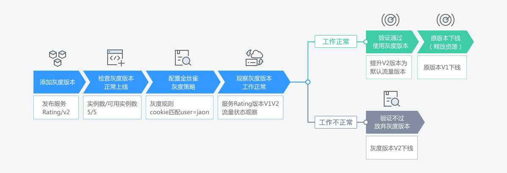

# 灰度发布概述

灰度发布是迭代的软件产品在生产环境安全上线的一种重要手段。

应用服务网格基于Istio提供的服务治理能力，对服务提供多版本支持和灵活的流量策略，从而支持多种灰度发布场景。

当前版本支持金丝雀发布和蓝绿发布。

## 金丝雀发布

在生产环境上引一部分实际流量对一个新版本进行测试，测试新版本的性能和表现，在保证系统整体稳定运行的前提下，尽早发现新版本在实际环境上的问题。

**金丝雀发布的特点：**

通过在线上运行的服务中，新加入少量的新版本的服务，然后从这少量的新版本中快速获得反馈，根据反馈决定最后的交付形态。

## 蓝绿发布

蓝绿发布提供了一种零宕机的部署方式。不停老版本，部署新版本进行测试，确认OK，将流量切到新版本，然后老版本同时也升级到新版本。始终有两个版本同时在线，有问题可以快速切换。

**蓝绿发布的特点：**

在部署应用的过程中，应用始终在线。并且新版本上线过程中，不会修改老版本的任何内容，在部署期间老版本状态不受影响。只要老版本的资源不被删除，可以在任何时间回滚到老版本。

## 灰度发布流程

在ASM中，用户无需使用繁琐的命令行配置，只需通过清晰友好的图形界面，就可轻松直观的完成灰度发布整个过程，如[图1](#fig17542677129)。

**图 1**  灰度发布过程  

