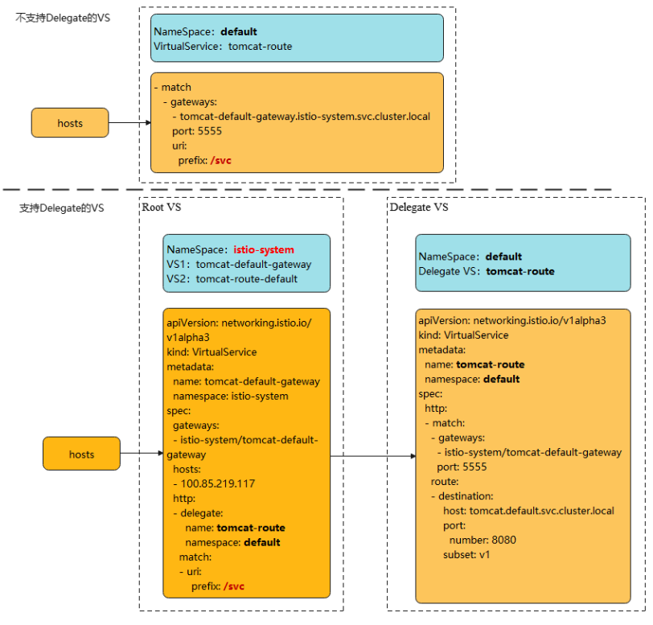
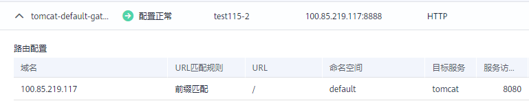

# 1.3升级1.8 VirtualService支持Delegate切换<a name="asm_01_0083"></a>

## 操作场景<a name="zh-cn_topic_0000001246831407_section1415014918"></a>

1.8版本的网格默认支持VirtualService的Delegate功能，同时ASM控制台界面也仅支持delegate格式的VirtualService，升级版本并不会对用户的VirtualService进行修改，在升级后用户将无法在页面对路由进行维护，因此用户需要根据本文指导对应用VirtualService进行修改。



> **说明：** 
>对于Delegate的介绍可以参考istio社区的说明：
>[https://istio.io/latest/docs/reference/config/networking/virtual-service/\#Delegate](https://istio.io/latest/docs/reference/config/networking/virtual-service/#Delegate)

## 约束与限制<a name="zh-cn_topic_0000001246831407_section105471049121011"></a>

-   只有在route和redirect为空时才能设置Delegate。
-   ASM只支持一级Delegate，多级Delegate不会生效。
-   Delegate VirtualService的HTTPMatchRequest必须是root VirtualService的子集，否则会产生冲突。
-   Delegate特性只对HTTP/gRPC协议有效，其他协议无需修改。

## 操作步骤<a name="zh-cn_topic_0000001246831407_section73771009118"></a>

修改将分两种情况，下面以加入网格的Tomcat服务为例。

**一、若升级前服务未添加网关，则升级后无需修改。**

**二、若升级前服务添加了网关，则升级后进行如下修改：**

1.  为网格所在集群配置kubectl命令，参考CCE控制台集群详情页的指导进行配置。
2.  在istio-system命名空间下创建两个VirtualService YAML文件。

    文件名：**tomcat**-default-gateway.yaml

    其中，

    -   tomcat：为修改的服务名
    -   tomcat-default-gateway：为该VirtualService名，格式为\{服务名\}-default-gateway
    -   tomcat-route：为修改VirtualService的名字
    -   100.85.219.117：为ELB的IP

    ```
    apiVersion: networking.istio.io/v1beta1
    kind: VirtualService
    metadata:
      name: tomcat-default-gateway
      namespace: istio-system
    spec:
      gateways:
      - istio-system/tomcat-default-gateway
      hosts:
      - 100.85.219.117
      http:
      - delegate:
          name: tomcat-route
          namespace: default
        match:
        - uri:
            prefix: /test
    
    ```

    文件名：**tomcat**-route-default.yaml

    其中，

    -   tomcat：为修改的服务名
    -   tomcat-route-default：为该VirtualService名，格式为\{服务名\}-route-default
    -   tomcat-route：为修改VirtualService的名字

    ```
    apiVersion: networking.istio.io/v1beta1
    kind: VirtualService
    metadata:
      name: tomcat-route-default
      namespace: istio-system
    spec:
      hosts:
      - tomcat.default.svc.cluster.local
      http:
      - delegate:
          name: tomcat-route
          namespace: default
        match:
        - uri:
            prefix: /
    
    ```

    使用如下命令创建VirtualService。

    **kubectl create -f tomcat-route-default.yaml**

    **kubectl create -f tomcat-default-gateway.yaml**

3.  **kubectl -n\{namespace\} get vs**获取到服务的VirtualService，执行**kubectl -n\{namespace\} edit vs tomcat-route**修改如下：

    1.  删除spec.gateways、spec.hosts和spec.http.match.uri
    2.  tomcat-default-gateway.istio-system.svc.cluster.local替换成istio-system/tomcat-default-gateway
    3.  修改apiVersion: networking.istio.io/v1alpha3为apiVersion: networking.istio.io/v1beta1
    4.  destination.host:格式为\{服务名\}.\{namespace\}.svc.cluster.local

    ```
    apiVersion: networking.istio.io/v1beta1
    kind: VirtualService
    metadata:
      name: tomcat-route
      namespace: default
    spec:
      gateways:
      - tomcat-default-gateway.istio-system.svc.cluster.local
      - mesh
      hosts:
      - tomcat
      - 100.85.219.117  # spec.gateways、spec.hosts需要删除
      http:
      - match:
        - gateways:
          - istio-system/tomcat-default-gateway
          port: 5555
          uri:
            prefix: /test  # spec.http.match.uri需要删除
        route:
        - destination:
            host: tomcat.default.svc.cluster.local
            port:
              number: 8080
            subset: v1
      - match:
        - gateways:
          - mesh
          port: 8080
        route:
        - destination:
            host: tomcat.default.svc.cluster.local
            port:
              number: 8080
            subset: v1
    ```

4.  升级完成后在服务列表页面，单击外部访问URL，检查访问是否正常。

    

5.  在服务网关页面，检查服务网关路由是否显示正常。

    


