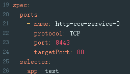

# Service在所有集群的配置是否相同

## 问题描述

如果网格管理了多个集群，其他集群的同名Service和当前集群的Service被视为同一个服务，spec.selector配置、spec.ports配置必须和当前Service相同。

> **说明：** 
>仅在网格管理的集群数量大于1时才可能出现此异常。

## 修复指导

修改多集群下同名Service的配置：

1.  登录CCE控制台，单击集群名称进入详情页面。
2.  在左侧导航栏选择“资源 \> 服务发现”，找到与本服务同名的服务，单击“更多 \> 编辑YAML”，修改spec.selector配置、spec.ports配置与本服务一致。

    

3.  重复[1](#li410314381381)\~[2](#li1157940436)，修改其他集群下同名Service的配置。

