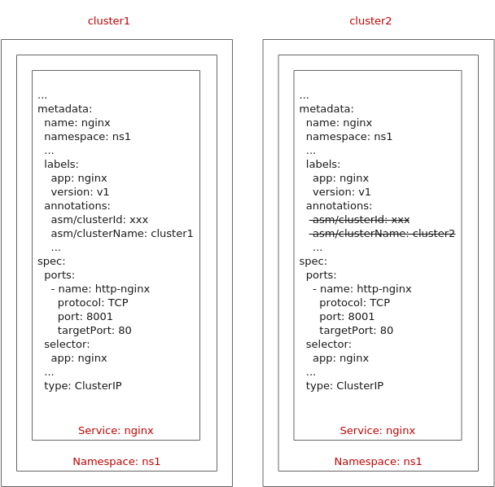

# Service是否支持跨集群访问

## 问题描述

服务支持跨集群访问，需要满足以下规则：

-   每个集群中必须有和此服务所在命名空间同名的命名空间。
-   每个集群中，同名命名空间下有同名同类型的服务。
-   每个同名服务中的labels、端口信息，以及selector中的内容完全相同。
-   除服务本身所在集群中的YAML文件annotations下带有asm/clusterId、asm/clusterName字段外，其他集群的同名服务都不包含上述字段。

通过以下示例，可以直观地看出服务支持跨集群访问需要满足的规则：

## 修复指导

1.  登录CCE控制台，选择服务所在集群，在“资源 \> 服务发现”页面查看服务所在的命名空间，然后选择网格内其他集群，创建同名命名空间。

    如果已有同名命名空间则跳过此步骤。

2.  选择服务所在集群，在“资源 \> 服务发现”页面选择对应的命名空间和服务，单击操作列的“更多 \> 编辑YAML”，复制文本框中的内容。
3.  选择网格内其他集群，在“资源 \> 服务发现”页面选择对应的命名空间，单击右上角“YAML创建”。
4.  将[2](#li7565105125111)中复制的内容粘贴到文本框中，删除其中的metadata.uid、metadata.resourceVersion、spec.clusterIP、spec.clusterIPs，以及metadata.annotations中的asm/clusterId、asm/clusterName字段。
5.  单击“确定”，确保服务创建成功。

