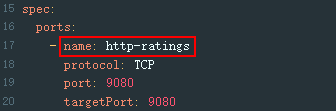

# Service的端口名称是否符合istio规范<a name="asm_01_0066"></a>

## 问题描述<a name="section19345459151110"></a>

Service端口名称必须包含指定的协议和前缀，按以下格式命名：

```
name: <protocol>[-<suffix>]
```

其中，<protocol\>可以是http、tcp、grpc等，Istio根据在端口上定义的协议来提供对应的路由能力。例如“name: http-service0”和“name: tcp”是合法的端口名；而“name: httpforecast”是非法的端口名。

如果未按照以上格式命名，则报此异常。

## 修复指导<a name="section102587454138"></a>

1.  登录CCE控制台，单击集群名称进入详情页面。
2.  在左侧导航栏选择“资源 \> 服务发现”，单击对应服务后的“更多 \> 编辑YAML”，查看Service协议，根据支持协议，修改协议，在服务名称前加协议类型，如下图。

    

3.  单击“确定”。

