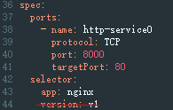

# Service的选择器中是否配置了version标签

## 问题描述

Service的选择器（spec.selector）中不能包含version标签。如果包含，则报此异常。

## 修复指导

1.  登录CCE控制台，单击集群名称进入详情页面。
2.  在左侧导航栏选择“资源 \> 服务发现”，单击对应服务后的“更多 \> 编辑YAML”，查看Service的选择器（spec.selector），删除已配置的version标签。

    

