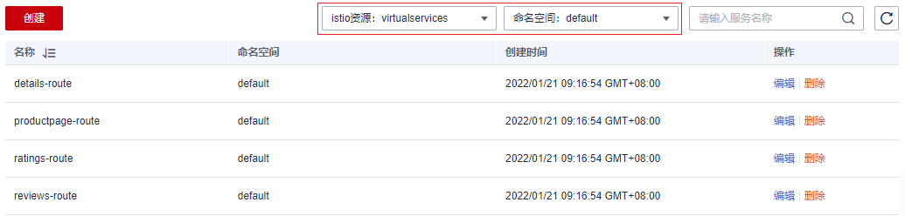
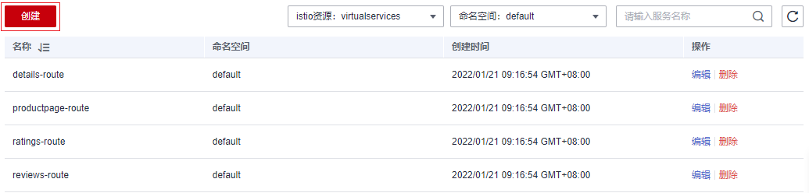

# YAML方式配置Istio资源

网格中服务关联的Istio资源（如VirtualService、DestinationRule）如需修改，可以在“istio资源管理”中以YAML或JSON格式进行编辑。同时，还支持创建新的istio资源。

> **注意：** 
>使用YAML方式创建和修改Istio资源可能导致与控制台配置不兼容，控制台相关功能将不再开放使用。如果您确定后续将只通过YAML方式维护Istio资源，则参考本章节编辑或新建Istio资源，否则请不要在此处操作。

## 编辑已有istio资源

1.  登录[应用服务网格控制台](https://console.huaweicloud.com/asm/?locale=zh-cn)，单击服务网格的名称，进入网格详情页面。
2.  在左侧导航栏选择“网格配置”，单击“istio资源管理”页签。
3.  在搜索框中选择istio资源类型（如“istio资源：virtualservices”），以及资源所属命名空间。

    **图 1**  筛选istio资源  
    

4.  单击操作列的“编辑”，在右侧页面修改相关配置，默认勾选底部提示信息，即控制台相关功能将不再开放使用，单击“确定”保存。

    > **说明：** 
    >编辑Istio资源后，具体哪些控制台功能不可用，与Istio资源类型有关，详细说明请参见[YAML配置资源处理策略](YAML配置资源处理策略.md)。

    支持以YAML或JSON格式显示，同时可以将配置文件下载到本地。

## 创建新的istio资源

1.  登录[应用服务网格控制台](https://console.huaweicloud.com/asm/?locale=zh-cn)，单击服务网格的名称，进入网格详情页面。
2.  在左侧导航栏选择“网格配置”，单击“istio资源管理”页签。
3.  单击列表左上方的“创建”。

    **图 2**  创建istio资源  
    

4.  在右侧页面直接输入内容，或者单击“导入文件”，将本地编辑好的YAML或JSON文件上传上来。
5.  确认文件内容无误，默认勾选底部提示信息，即控制台相关功能将不再开放使用，单击“确定”保存。

    > **说明：** 
    >创建Istio资源后，具体哪些控制台功能不可用，与Istio资源类型有关，详细说明请参见[YAML配置资源处理策略](YAML配置资源处理策略.md)。

## Istio资源说明

**表 1**  Istio资源说明

<table><thead align="left"><tr id="row862013522566"><th class="cellrowborder" valign="top" width="27.689999999999998%" id="mcps1.2.3.1.1">
资源类型

</th>
<th class="cellrowborder" valign="top" width="72.31%" id="mcps1.2.3.1.2">
说明

</th>
</tr>
</thead>
<tbody><tr id="row621427185917"><td class="cellrowborder" valign="top" width="27.689999999999998%" headers="mcps1.2.3.1.1 ">
AuthorizationPolicy

</td>
<td class="cellrowborder" valign="top" width="72.31%" headers="mcps1.2.3.1.2 ">
用于配置授权规则。

</td>
</tr>
<tr id="row17620125265618"><td class="cellrowborder" valign="top" width="27.689999999999998%" headers="mcps1.2.3.1.1 ">
DestinationRule

</td>
<td class="cellrowborder" valign="top" width="72.31%" headers="mcps1.2.3.1.2 ">
定义路由的目标服务和流量策略。VirtualService和DestinationRule是流量控制最关键的两个资源，DestinationRule定义了网格中某个Service对外提供服务的策略及规则，包括负载均衡策略、异常点监测、熔断控制、访问连接池等。

</td>
</tr>
<tr id="row196209526568"><td class="cellrowborder" valign="top" width="27.689999999999998%" headers="mcps1.2.3.1.1 ">
EnvoyFilter

</td>
<td class="cellrowborder" valign="top" width="72.31%" headers="mcps1.2.3.1.2 ">
EnvoyFilter为服务网格控制面提供更强大的扩展能力，使Envoy中Filter Chain具备自定义配置的能力。

</td>
</tr>
<tr id="row8620155225614"><td class="cellrowborder" valign="top" width="27.689999999999998%" headers="mcps1.2.3.1.1 ">
Gateway

</td>
<td class="cellrowborder" valign="top" width="72.31%" headers="mcps1.2.3.1.2 ">
Gateway定义了所有HTTP/TCP流量进入网格或者从网格中出站的统一入口和出口，它描述了一组对外公开的端口、协议、负载均衡以及SNI配置。

</td>
</tr>
<tr id="row76205526568"><td class="cellrowborder" valign="top" width="27.689999999999998%" headers="mcps1.2.3.1.1 ">
IstioOperator

</td>
<td class="cellrowborder" valign="top" width="72.31%" headers="mcps1.2.3.1.2 ">
可以通过编辑IstioOperator对象来改变Istio的配置，控制器会检测到改变，继而用相应配置更新Istio的安装内容。

</td>
</tr>
<tr id="row662055210567"><td class="cellrowborder" valign="top" width="27.689999999999998%" headers="mcps1.2.3.1.1 ">
PeerAuthentication

</td>
<td class="cellrowborder" valign="top" width="72.31%" headers="mcps1.2.3.1.2 ">
Istio的认证策略包含PeerAuthentication和RequestAuthentication，PeerAuthentication策略用于配置服务通信的mTLS模式。

</td>
</tr>
<tr id="row17532161415111"><td class="cellrowborder" valign="top" width="27.689999999999998%" headers="mcps1.2.3.1.1 ">
RequestAuthentication

</td>
<td class="cellrowborder" valign="top" width="72.31%" headers="mcps1.2.3.1.2 ">
Istio的认证策略包含PeerAuthentication和RequestAuthentication，RequestAuthentication策略用于配置服务的请求身份验证方法。

</td>
</tr>
<tr id="row183423210116"><td class="cellrowborder" valign="top" width="27.689999999999998%" headers="mcps1.2.3.1.1 ">
ServiceEntry

</td>
<td class="cellrowborder" valign="top" width="72.31%" headers="mcps1.2.3.1.2 ">
用于注册外部服务到网格内，并对其流量进行管理。

</td>
</tr>
<tr id="row1426431920"><td class="cellrowborder" valign="top" width="27.689999999999998%" headers="mcps1.2.3.1.1 ">
Sidecar

</td>
<td class="cellrowborder" valign="top" width="72.31%" headers="mcps1.2.3.1.2 ">
对Sidecar代理进行整体设置。

</td>
</tr>
<tr id="row362025212568"><td class="cellrowborder" valign="top" width="27.689999999999998%" headers="mcps1.2.3.1.1 ">
VirtualService

</td>
<td class="cellrowborder" valign="top" width="72.31%" headers="mcps1.2.3.1.2 ">
用于网格内路由的设置。VirtualService和DestinationRule是流量控制最关键的两个资源，在VirtualService中定义了一组路由规则，当流量进入时，逐个规则进行匹配，直到匹配成功后将流量转发给指定的路由地址。

</td>
</tr>
<tr id="row3620195217568"><td class="cellrowborder" valign="top" width="27.689999999999998%" headers="mcps1.2.3.1.1 ">
WorkloadEntry

</td>
<td class="cellrowborder" valign="top" width="72.31%" headers="mcps1.2.3.1.2 ">
用来将虚拟机（VM）或者裸金属（Bare Metal）进行抽象，使其在网格化后作为与Kubernetes中的Pod同等重要的负载，具备流量管理、安全管理、可视化等能力。

</td>
</tr>
</tbody>
</table>

