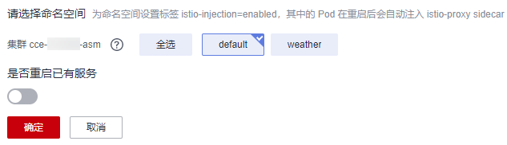
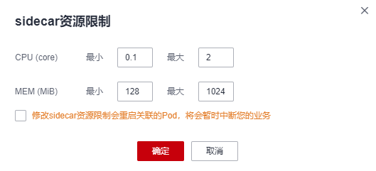
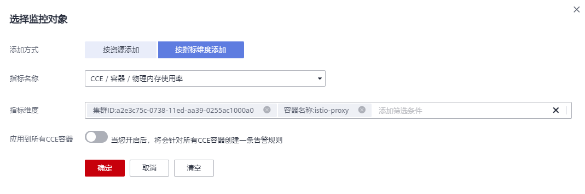
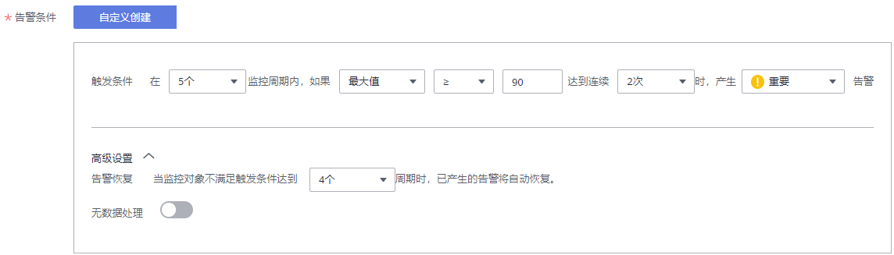
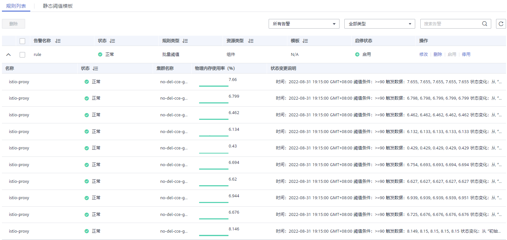
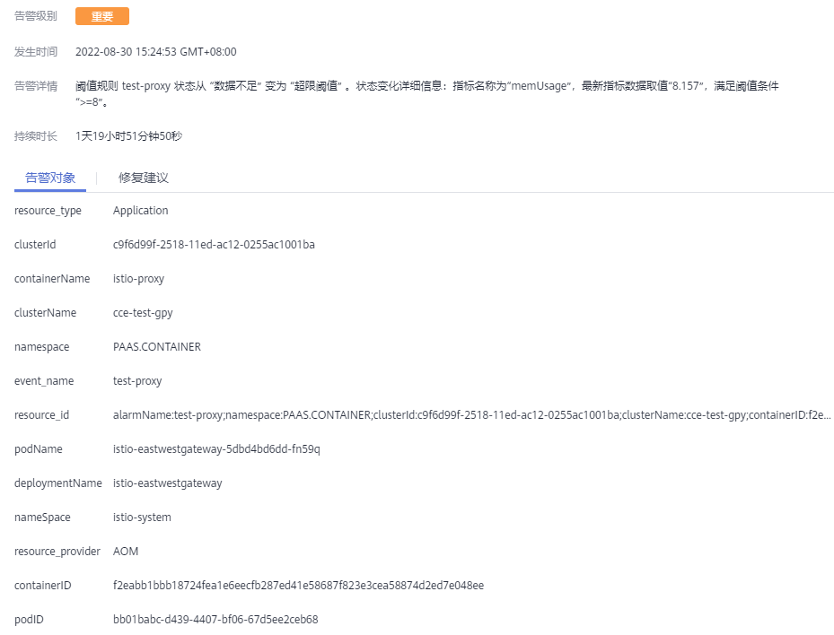

# sidecar管理<a name="asm_01_0041"></a>

sidecar管理中支持查看所有注入了sidecar的工作负载信息，还可以进行sidecar注入、配置sidecar资源限制等操作。

## sidecar注入<a name="section65931513505"></a>

可展示当前已注入sidecar的命名空间及所属集群。如果还未做过注入操作，或者需要为更多命名空间注入sidecar，请参考以下操作：

1.  登录[应用服务网格控制台](https://console.huaweicloud.com/asm/?locale=zh-cn)，单击服务网格的名称，进入网格详情页面。
2.  在左侧导航栏选择“网格配置”，单击“sidecar管理”页签。
3.  单击“sidecar注入”，选择命名空间，判断是否重启已有服务，单击“确定”。

    **图 1**  注入sidecar<a name="fig16347236164114"></a>  
    

    -   选择命名空间：选择一个或多个命名空间，系统将为命名空间设置标签istio-injection=enabled。
    -   是否重启已有服务：

        ：会重启命名空间下已有服务关联的Pod，将会暂时中断业务。只有在重启后，已有服务关联的Pod才会自动注入istio-proxy sidecar。

        ：已有服务关联的Pod不会自动注入istio-proxy sidecar，需要在CCE控制台，手动重启工作负载才会注入sidecar。当然了，是否重启已有服务只会影响已有服务，只要为命名空间设置了istio-injection=enabled标签，后面新建的服务实例都会自动注入sidecar。

    > **说明：** 
    >-   若界面提示“以下集群未开放命名空间注入修改操作”，可能因为当前网格是通过1.0控制台创建的，默认不开放命名空间注入，需要通过kubectl命令行开放，具体操作请参见[如何为集群开放命名空间注入？](https://support.huaweicloud.com/asm_faq/asm_faq_0036.html)。
    >-   为集群的命名空间开启sidecar注入后，该命名空间下所有工作负载关联的Pod将自动注入sidecar。如果某些工作负载不希望注入sidecar，可参考[某些工作负载不注入sidecar，该如何配置？](https://support.huaweicloud.com/asm_faq/asm_faq_0037.html)进行配置。
    >-   对于1.8.4-r1及之前（所有1.3、1.6）版本的网格，建议确认工作负载是否包含注解：sidecar.istio.io/inject: 'true'。如未包含，请在spec.template.metadata.annotations字段下添加：
    >    ```
    >          annotations:
    >            sidecar.istio.io/inject: 'true'
    >    ```


## 查看工作负载详情<a name="section259115115019"></a>

列表中展示了该网格所管理的集群下所有已创建服务的工作负载，支持查看负载的名称、所属集群、服务，以及负载的sidecar信息，包括sidecar名称、sidecar版本、状态、CPU使用率、内存使用率等。操作方法如下：

1.  在列表右上角搜索框，选择集群、命名空间，并输入工作负载名称搜索指定工作负载，查看负载的相关信息。
2.  单击工作负载前的图标，查看负载的sidecar信息。

    如果提示工作负载中无sidecar，是因为该负载所属命名空间还未注入sidecar，参考[sidecar注入](#section65931513505)进行注入。


## 配置sidecar资源限制<a name="section1260131575013"></a>

支持为sidecar（即istio-proxy容器）配置CPU和内存的资源上下限。同一个节点上部署的工作负载，对于未设置资源上下限的工作负载，如果其异常资源泄露会导致其他工作负载分配不到资源而异常。未设置资源上下限的工作负载，工作负载监控信息也会不准确。

默认的sidecar资源上下限为：

-   CPU（Core）：最小 0.1，最大 2
-   MEM（MiB）：最小 128，最大 1024

如需更改，请参考以下操作：

1.  单击工作负载操作列的“sidecar资源限制”，也可以勾选多个工作负载，在列表左上角单击“sidecar资源限制”进行批量配置。

    **图 2**  sidecar资源限制<a name="fig12220059794"></a>  
    

    -   CPU最小值：也称CPU请求，表示容器使用的最小CPU需求，作为容器调度时资源分配的判断依赖。只有当节点上可分配CPU总量 ≥ 容器CPU请求数时，才允许将容器调度到该节点。
    -   CPU最大值：也称CPU限制，表示容器能使用的CPU最大值。
    -   MEM最小值：也称内存请求，表示容器使用的最小内存需求，作为容器调度时资源分配的判断依赖。只有当节点上可分配内存总量 ≥ 容器内存请求数时，才允许将容器调度到该节点。
    -   MEM最大值：也称内存限制，表示容器能使用的内存最大值。当内存使用率超出设置的内存限制值时，该实例可能会被重启进而影响工作负载的正常使用。


## 为sidecar资源配置内存告警<a name="section65763519407"></a>

当内存使用率超出设置的内存限制值时，该实例可能会被重启进而影响工作负载的正常使用。因此，建议用户为所有sidecar资源配置内存告警，当告警被触发后，及时扩容对应sidecar的内存最大值，可降低业务影响范围。

1.  登录应用运维管理 AOM控制台。
2.  在左侧导航栏选择“告警 \> 告警规则”，单击右上角“添加规则”。
3.  设置告警规则。
    -   规则名称：输入规则名称，例如：istio-proxy。
    -   规则类型：选择“阈值规则”。
    -   监控对象：单击“选择资源对象”，选择“按指标维度添加”，指标名称选择“云服务指标 \> CCE \> 容器 \> 物理内存使用率”。

        指标维度选择“集群ID”，选择开启告警的集群ID；选择“容器名称”，容器名称选择“istio-proxy”，单击“确定”。

        **图 3**  选择监控对象<a name="fig136473118019"></a>  
        

    -   告警条件：设置统计周期、连续周期、阈值条件等触发条件参数，如下图所示，请根据具体需求设置。

        **图 4**  设置告警条件<a name="fig14610121418"></a>  
        

    -   告警方式：选择“直接告警”。

4.  单击“立即创建”。

    创建后在规则列表中可以看到如下一行，表示创建成功。

    **图 5**  规则列表<a name="fig19139130820"></a>  
    

5.  在告警列表中可以查看最新的活动告警信息及对应负载的详情。

    当告警被触发后，活动告警列表会新增一条或多条记录。单击告警名称，在“告警对象”页签查看deploymentName、nameSpace等参数，以确定告警源自哪个sidecar资源。业务面sidecar资源限制请参考[配置sidecar资源限制](#section1260131575013)修改，istio-ingressgateway、istio-egressgateway、istio-eastwestgateway等控制面sidecar资源限制需要在CCE控制台“工作负载”页面通过升级方式来修改。

    **图 6**  告警详情<a name="fig613311112119"></a>  
    


