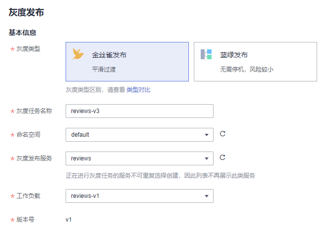

# 创建灰度任务

## 基本概念

-   灰度版本

    一个服务仅支持发布一个灰度版本，可以对灰度版本配置相应的灰度策略。

-   灰度策略

    当您需要在生产环境发布一个新的待上线版本时，您可以选择添加一个灰度版本，并配置相应的灰度策略，将原有的生产环境的默认版本的流量引流一部分至待上线版本。经过评估稳定后，可以将此灰度版本接管所有流量，下线原来的版本，从而接管原有的生产环境的版本上的流量。

## 创建灰度发布

1.  登录[应用服务网格控制台](https://console.huaweicloud.com/asm/?locale=zh-cn)，使用以下任意一种方式进入创建灰度任务页面。
    -   （快捷方式）在网格右上方，单击图标。
    -   （快捷方式）在网格中心位置，单击“创建灰度任务”。
    -   在网格详情页创建。
        1.  单击网格名称，进入网格详情页，单击左侧导航栏的“灰度发布”。
        2.  如果当前不存在发布中的灰度任务，请在金丝雀发布或蓝绿发布中单击“立即发布”；如果当前存在发布中的灰度任务，请单击右上角“灰度发布”。

2.  配置灰度发布基本信息。

    -   **灰度类型**

        选择创建灰度发布的类型，可根据实际需求选择金丝雀发布和蓝绿发布，两者的区别可参考[灰度发布概述](灰度发布概述.md)。

    -   **灰度任务名称**

        自定义灰度任务的名称。输入长度范围为4到63个字符，包含小写英文字母、数字和中划线（-），并以小写英文字母开头，小写英文字母或数字结尾。

    -   **命名空间**

        服务所在的命名空间。

    -   **灰度发布服务**

        在下拉列表中选择待发布的服务。正在进行灰度任务的服务不可再进行选择，列表中已自动过滤。

    -   **工作负载**

        选择服务所属的工作负载。

    -   **版本号**

        当前服务版本号，版本号不支持修改。

    **图 1**  灰度发布基本信息  
    

3.  部署灰度版本信息。

    -   **部署集群**

        灰度发布服务所属的集群。

    -   **版本号**

        输入服务的灰度版本号。

    -   **实例数量**

        灰度版本的实例数量。灰度版本可以有一个或多个实例，用户可根据实际需求进行修改。每个灰度版本的实例都由相同的容器部署而成。

    -   **镜像名称**

        默认为该服务的镜像。

    -   **镜像版本**

        请选择灰度版本的镜像版本。

    **图 2**  灰度版本信息  
    

4.  单击“发布“，灰度版本开始创建。

    请确保灰度版本的实例状态正常，且启动进度为100%时，再开始下一步进行流量策略的配置。发布之后进入观察灰度状态页面，可查看Pod监控，包括启动日志和性能监控信息。

5.  （仅金丝雀发布涉及）单击“配置流量策略”，进行流量策略配置。

    策略类型：分为“基于流量比例”和“基于请求内容”两种类型，通过页签选择确定。

    -   **基于流量比例**

        根据流量比例配置规则，从默认版本中切分指定比例的流量到灰度版本。例如75%的流量走默认版本，25%的流量走灰度版本。实际应用时，可根据需求将灰度版本的流量配比逐步增大并进行策略下发，来观测灰度版本的表现情况。

        **图 3**  基于流量比例  
        

        **流量配比**：可以为默认版本与灰度版本设置流量配比，系统将根据输入的流量配比来确定流量在两个版本间分发的比重。

    -   **基于请求内容**

        目前支持基于Cookie内容、自定义Header、Query、操作系统和浏览器的规则约束，只有满足规则约束的流量才可访问到灰度版本。例如，仅Cookie满足“User=Internal”的HTTP请求才能转发到灰度版本，其余请求仍然由默认版本接收。

        **图 4**  基于请求内容  
        

        -   Cookie内容

            正则匹配：此处需要您使用正则表达式来匹配相应的规则。

        -   自定义Header
            -   完全匹配：只有完全匹配上才能生效。例如：设置Header的Key=User，Vaule=Internal，那么仅当Header中包含User且值为Internal的请求才由灰度版本响应。
            -   正则匹配：此处需要您使用正则表达式来匹配相应的规则。

                可以自定义请求头的key和value，value支持完全匹配和正则匹配。

        -   Query
            -   完全匹配：只有完全匹配上才能生效。例如：设置Query的Key=User，Vaule=Internal，那么仅当Query中包含User且值为Internal的请求才由灰度版本响应。
            -   正则匹配：此处需要您使用正则表达式来匹配相应的规则。

                可以自定义Query的key和value，value支持完全匹配和正则匹配。

        -   允许访问的操作系统：请选择允许访问的操作系统，包括iOS、Android、Windows、macOS。
        -   允许访问的浏览器：请选择允许访问的浏览器，包括Chrome、IE。
        -   流量管理Yaml信息：根据所设置的参数自动生成规则YAML。

    > **说明：** 
    >基于请求内容流量策略只对直接访问的入口服务有效。如果希望对所有服务有效，需要业务代码对HTTP请求的Header信息进行传播。
    >例如：如果您基于reviews服务，配置了基于请求内容的灰度发布策略，通过访问productpage服务的界面，是无法看到效果的。
    >原因是，您的客户端访问productpage服务携带了HTTP请求的Header信息，而productpage服务请求reviews服务时，将这些Header信息丢失了（详情可参考[如何使用Istio调用链埋点](流量监控.md#section437112311448)），从而失去了基于请求内容的灰度发布效果。

6.  设置完成后，单击“策略下发“。

    灰度策略的生效需要几秒时间，您可以查看服务的流量监控，以及对原始版本及灰度版本的健康监控。

