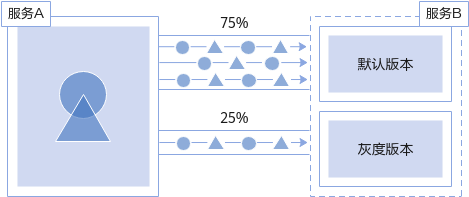

# 创建灰度任务

## 基本概念

-   灰度版本

    一个服务仅支持发布一个灰度版本，可以对灰度版本配置相应的灰度策略。

-   灰度策略

    当您需要在生产环境发布一个新的待上线版本时，您可以选择添加一个灰度版本，并配置相应的灰度策略，将原有的生产环境的默认版本的流量引流一部分至待上线版本。经过评估稳定后，可以将此灰度版本接管所有流量，下线原来的版本，从而接管原有的生产环境的版本上的流量。

## 创建灰度发布

1.  登录应用服务网格控制台，选择需要创建灰度发布的网格名称，在左侧导航栏中选择“灰度发布“。
2.  在页面右侧页面，单击“灰度发布”。您还可以在总览页面，单击已创建网格内的灰度发布按钮。
3.  配置灰度发布基本信息。

    -   **灰度类型**

        选择创建灰度发布的类型，可根据实际需求选择金丝雀发布和蓝绿发布，两者的区别可参考[灰度发布概述](https://support.huaweicloud.com/usermanual-istio/istio_01_0035.html)。

    -   **灰度任务名称**

        新建灰度发布的名称，输入长度范围为4到63个字符，包含小写英文字母、数字和中划线（-），并已小写字母为开头，小写英文字母或数字结尾的字符串。

    -   **命名空间**

        服务所在的命名空间。

    -   **灰度发布服务**

        单击“选择服务”，选择添加灰度版本的服务。正在进行灰度任务的服务不可再进行选择。

    -   **工作负载**

        选择服务所属的工作负载。

    -   **版本号**

        当前服务版本号，版本号不支持修改。

    **图 1**  灰度发布基本信息  
    

4.  部署灰度版本信息。

    -   **部署集群**

        灰度发布服务所属的集群。

    -   **版本号**

        新增服务中灰度版本号。

    -   **实例数量**

        灰度版本的实例数量。灰度版本可以有一个或多个实例，用户可根据实际需求进行修改。每个灰度版本的实例都由相同的容器部署而成。

    -   **镜像名称**

        默认为该服务的镜像。

    -   **镜像版本**

        请选择需要添加灰度的镜像版本。

    **图 2**  灰度版本信息  
    

5.  单击“发布“，灰度版本开始创建。

    请确保灰度版本的实例状态为正常时，再开始下一步进行灰度策略的配置。发布之后进入观察灰度状态页面，可查看pod监控，包括启动日志和性能监控信息。

6.  单击“配置灰度策略”，进行灰度策略配置。

    策略类型：分为“基于流量比例”和“基于请求内容”两种类型，通过页签选择确定，您可参考[灰度策略类型](https://support.huaweicloud.com/usermanual-istio/istio_01_0037.html#section2)进行选择。

    -   **基于流量比例**

        根据流量比例配置规则，将从原版本中切分指定比例的流量到灰度版本。

        -   流量配比：根据输入的流量配比来确定流量分发的比重。

            范围限制为\[0,100\]。例如，当您配置为10，则10%的服务流量会走向灰度版本。

        **图 3**  基于流量比例  
        

    -   **基于请求内容**

        根据请求内容配置规则，只有请求内容中满足特定条件的流量会切分到灰度版本上。

        > **说明：** 
        >该策略只对直接访问的入口服务有效。如希望对所有服务有效，需业务代码对HEAD信息传播。

        -   Cookie内容：
            -   完全匹配：当且仅当表达式完全符合此情况时，流量才会走到灰度版本。
            -   正则匹配：此处需要您使用正则表达式来匹配相应的规则。

        -   自定义Header：
            -   完全匹配：当且仅当表达式完全符合此情况时，流量才会走到灰度版本。
            -   正则匹配：此处需要您使用正则表达式来匹配相应的规则。

                可以自定义请求头的key和value，value支持完全匹配和正则匹配。

        -   Query：
            -   完全匹配：当且仅当表达式完全符合此情况时，流量才会走到灰度版本。
            -   正则匹配：此处需要您使用正则表达式来匹配相应的规则。

                可以自定义请求头的key和value，value支持完全匹配和正则匹配。

        -   允许访问的操作系统：请选择允许访问的操作系统，包括iOS、android、windows、macOS。
        -   允许访问的浏览器：请选择允许访问的浏览器，包括Chrome、IE。
        -   流量管理Ymal信息：当前服务的流量转发的规则描述信息及Yaml的查看。

        **图 4**  基于请求内容  
        

    > **说明：** 
    >如果服务是多端口，每个端口都会配置策略。

7.  设置完成后，单击“策略下发“。

    灰度策略的生效需要几秒时间，您可以查看服务的流量监控，以及对原始版本及灰度版本的健康监控。

