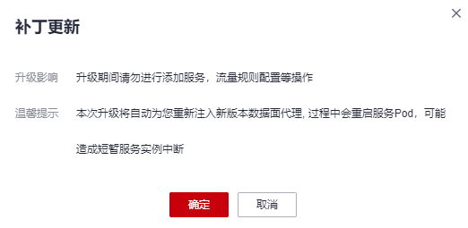

# 升级网格

## 操作场景

用户可以将低版本的网格升级到高版本，以获取更优质的体验。

## 升级影响

-   网格升级将自动重新注入新版本数据面代理，过程中会滚动重启服务Pod，可能造成短暂服务实例中断。
-   升级期间请勿进行灰度发布、流量规则配置等操作。

## 升级路径

<table><thead align="left"><tr id="zh-cn_topic_0000001241265531_row198811045154113"><th class="cellrowborder" valign="top" width="12.748725127487251%" id="mcps1.1.5.1.1">
网格类型

</th>
<th class="cellrowborder" valign="top" width="17.718228177182283%" id="mcps1.1.5.1.2">
源版本

</th>
<th class="cellrowborder" valign="top" width="30.006999300069992%" id="mcps1.1.5.1.3">
目标版本

</th>
<th class="cellrowborder" valign="top" width="39.52604739526047%" id="mcps1.1.5.1.4">
升级方式

</th>
</tr>
</thead>
<tbody><tr id="zh-cn_topic_0000001241265531_row16881144514411"><td class="cellrowborder" rowspan="6" valign="top" width="12.748725127487251%" headers="mcps1.1.5.1.1 ">
企业版

</td>
<td class="cellrowborder" valign="top" width="17.718228177182283%" headers="mcps1.1.5.1.2 ">
1.8.4-r1

</td>
<td class="cellrowborder" valign="top" width="30.006999300069992%" headers="mcps1.1.5.1.3 ">
1.8.6-r1

</td>
<td class="cellrowborder" valign="top" width="39.52604739526047%" headers="mcps1.1.5.1.4 ">
补丁更新

</td>
</tr>
<tr id="zh-cn_topic_0000001241265531_row158811645154117"><td class="cellrowborder" valign="top" headers="mcps1.1.5.1.1 ">
1.8.4-r2

</td>
<td class="cellrowborder" valign="top" headers="mcps1.1.5.1.2 ">
1.8.6-r1

</td>
<td class="cellrowborder" valign="top" headers="mcps1.1.5.1.3 ">
补丁更新

</td>
</tr>
<tr id="zh-cn_topic_0000001241265531_row1788164514411"><td class="cellrowborder" valign="top" headers="mcps1.1.5.1.1 ">
1.8.4-r3

</td>
<td class="cellrowborder" valign="top" headers="mcps1.1.5.1.2 ">
1.8.6-r1

</td>
<td class="cellrowborder" valign="top" headers="mcps1.1.5.1.3 ">
补丁更新

</td>
</tr>
<tr id="row1338844074310"><td class="cellrowborder" valign="top" headers="mcps1.1.5.1.1 ">
1.8.4-r4

</td>
<td class="cellrowborder" valign="top" headers="mcps1.1.5.1.2 ">
1.8.6-r1

</td>
<td class="cellrowborder" valign="top" headers="mcps1.1.5.1.3 ">
补丁更新

</td>
</tr>
<tr id="row861016434432"><td class="cellrowborder" valign="top" headers="mcps1.1.5.1.1 ">
1.8.4-r5

</td>
<td class="cellrowborder" valign="top" headers="mcps1.1.5.1.2 ">
1.8.6-r1

</td>
<td class="cellrowborder" valign="top" headers="mcps1.1.5.1.3 ">
补丁更新

</td>
</tr>
<tr id="zh-cn_topic_0000001241265531_row6881345174113"><td class="cellrowborder" valign="top" headers="mcps1.1.5.1.1 ">
1.6.9-r4

</td>
<td class="cellrowborder" valign="top" headers="mcps1.1.5.1.2 ">
1.6.9-r5

</td>
<td class="cellrowborder" valign="top" headers="mcps1.1.5.1.3 ">
补丁更新

</td>
</tr>
<tr id="zh-cn_topic_0000001241265531_row1988184513410"><td class="cellrowborder" rowspan="5" valign="top" width="12.748725127487251%" headers="mcps1.1.5.1.1 ">
基础版

</td>
<td class="cellrowborder" valign="top" width="17.718228177182283%" headers="mcps1.1.5.1.2 ">
1.8.4-r1

</td>
<td class="cellrowborder" valign="top" width="30.006999300069992%" headers="mcps1.1.5.1.3 ">
1.8.6-r1

</td>
<td class="cellrowborder" valign="top" width="39.52604739526047%" headers="mcps1.1.5.1.4 ">
补丁更新

</td>
</tr>
<tr id="zh-cn_topic_0000001241265531_row14881945174118"><td class="cellrowborder" valign="top" headers="mcps1.1.5.1.1 ">
1.8.4-r2

</td>
<td class="cellrowborder" valign="top" headers="mcps1.1.5.1.2 ">
1.8.6-r1

</td>
<td class="cellrowborder" valign="top" headers="mcps1.1.5.1.3 ">
补丁更新

</td>
</tr>
<tr id="zh-cn_topic_0000001241265531_row17880154474514"><td class="cellrowborder" valign="top" headers="mcps1.1.5.1.1 ">
1.8.4-r3

</td>
<td class="cellrowborder" valign="top" headers="mcps1.1.5.1.2 ">
1.8.6-r1

</td>
<td class="cellrowborder" valign="top" headers="mcps1.1.5.1.3 ">
补丁更新

</td>
</tr>
<tr id="row152096278447"><td class="cellrowborder" valign="top" headers="mcps1.1.5.1.1 ">
1.8.4-r4

</td>
<td class="cellrowborder" valign="top" headers="mcps1.1.5.1.2 ">
1.8.6-r1

</td>
<td class="cellrowborder" valign="top" headers="mcps1.1.5.1.3 ">
补丁更新

</td>
</tr>
<tr id="row1417063034412"><td class="cellrowborder" valign="top" headers="mcps1.1.5.1.1 ">
1.8.4-r5

</td>
<td class="cellrowborder" valign="top" headers="mcps1.1.5.1.2 ">
1.8.6-r1

</td>
<td class="cellrowborder" valign="top" headers="mcps1.1.5.1.3 ">
补丁更新

</td>
</tr>
<tr id="zh-cn_topic_0000001241265531_row088017445453"><td class="cellrowborder" rowspan="5" valign="top" width="12.748725127487251%" headers="mcps1.1.5.1.1 ">
专有版

</td>
<td class="cellrowborder" valign="top" width="17.718228177182283%" headers="mcps1.1.5.1.2 ">
1.3.0-r4

</td>
<td class="cellrowborder" valign="top" width="30.006999300069992%" headers="mcps1.1.5.1.3 ">
1.3.0-r9

</td>
<td class="cellrowborder" valign="top" width="39.52604739526047%" headers="mcps1.1.5.1.4 ">
补丁更新

</td>
</tr>
<tr id="zh-cn_topic_0000001241265531_row9658111324719"><td class="cellrowborder" valign="top" headers="mcps1.1.5.1.1 ">
1.3.0-r4

</td>
<td class="cellrowborder" valign="top" headers="mcps1.1.5.1.2 ">
先升级至1.8.4-r1，再升级至1.8.6-r1

</td>
<td class="cellrowborder" valign="top" headers="mcps1.1.5.1.3 ">
先版本升级，再补丁更新

</td>
</tr>
<tr id="zh-cn_topic_0000001241265531_row121281714714"><td class="cellrowborder" valign="top" headers="mcps1.1.5.1.1 ">
1.3.0-r9

</td>
<td class="cellrowborder" valign="top" headers="mcps1.1.5.1.2 ">
先升级至1.8.4-r1，再升级至1.8.6-r1

</td>
<td class="cellrowborder" valign="top" headers="mcps1.1.5.1.3 ">
先版本升级，再补丁更新

</td>
</tr>
<tr id="zh-cn_topic_0000001241265531_row2012117204712"><td class="cellrowborder" valign="top" headers="mcps1.1.5.1.1 ">
1.3.0-r4

</td>
<td class="cellrowborder" valign="top" headers="mcps1.1.5.1.2 ">
先升级至1.3.0-r9，再升级至1.8.4-r1，最后升级至1.8.6-r1

</td>
<td class="cellrowborder" valign="top" headers="mcps1.1.5.1.3 ">
先补丁更新，再版本升级，最后补丁更新

</td>
</tr>
<tr id="row96951236105612"><td class="cellrowborder" valign="top" headers="mcps1.1.5.1.1 ">
1.6.9-r4

</td>
<td class="cellrowborder" valign="top" headers="mcps1.1.5.1.2 ">
1.6.9-r5

</td>
<td class="cellrowborder" valign="top" headers="mcps1.1.5.1.3 ">
补丁更新

</td>
</tr>
</tbody>
</table>

> **说明：** 
>各大版本特性请参见[1.3版本特性](1-3版本特性.md)、[1.6版本特性](1-6版本特性.md)、[1.8版本特性](1-8版本特性.md)和[1.13版本特性](1-13版本特性.md)。

## 操作步骤

1.  登录[应用服务网格控制台](https://console.huaweicloud.com/asm/?locale=zh-cn)，确认网格是否需要升级版本。判断方法如下：

    -   列表上方是否提示可升级版本的网格。

        

    -   网格名称右侧是否存在“可升级”提示。

        

    若存在可升级版本的网格，单击该网格名称，进入网格详情页面。

2.  在左侧导航栏选择“网格配置”，单击“升级”页签。
3.  根据[升级路径](#zh-cn_topic_0000001241265531_section20209132918418)选择合适的升级方式完成网格升级。
    -   **版本升级**

        单击“版本升级”，系统自动完成升级诊断，检查结果全部成功后，单击“升级”。

        > **说明：** 
        >1.3.0版本升级至1.8.4时，VirtualService格式检查项的结果为“警告”，原因是1.8及以上版本网格界面仅支持显示delegate格式的 VirtualService，需要根据[1.3升级1.8 VirtualService支持Delegate切换](1-3升级1-8-VirtualService支持Delegate切换.md)进行修改，否则升级后将看不到创建的网关路由。不过，该检查项并不会导致升级失败。

    -   **补丁更新**

        单击“补丁更新”，在弹出的提示框中单击“确定”。

        **图 1**  补丁更新  
        

