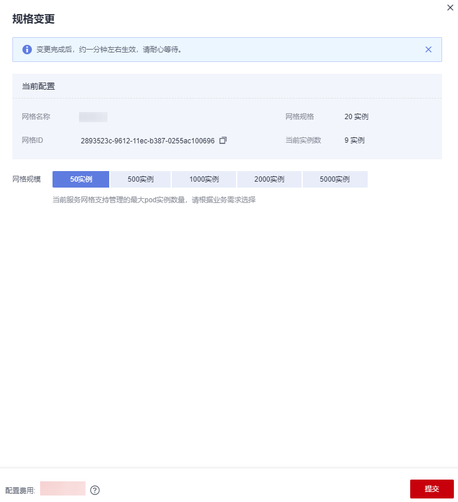

# 变更规格

## 操作场景

当您购买的服务网格规模无法满足业务需要时，可参考本章节变更规格。

## 约束与限制

-   基础版网格规模固定为200实例，不支持变更。
-   企业版按需计费网格规模固定为5000实例，不支持变更。

## 操作步骤

1.  登录[应用服务网格控制台](https://console.huaweicloud.com/asm/?locale=zh-cn)，在对应的网格下单击“规格变更”。
2.  选择网格规模，单击“提交”。

    **图 1**  变更规格  
    

3.  选择支付方式后，单击“确认付款”。

    变更完成后，约一分钟左右生效，请耐心等待。

