# 启用应用服务网格

启用Istio将为您的服务以无侵入的方式提供灵活的服务治理能力。您只需在CCE集群中开启应用服务网格功能，即可实现灰度发布、流量管理、熔断、监控、拓扑、调用链等丰富的服务治理能力。

## 前提条件

已创建CCE混合集群，如果未创建，请参照[购买CCE集群](https://support.huaweicloud.com/usermanual-cce/cce_01_0028.html)创建。

## 使用须知

-   Istio服务网格依赖集群coreDNS的域名解析能力，启用Istio服务网格前请确保集群拥有足够资源，且coreDNS组件运行正常。
-   启用Istio时，需要开通node节点所在安全组的入方向7443端口规则，用于sidecar自动注入回调。如果您使用CCE创建的默认安全组，此端口会自动开通。如果您自建安全组规则，请手动开通7443端口，以确保Istio自动注入能力正常。

## 背景信息

**专有网格**

在用户集群中安装网格的控制面组件，对集群内的服务进行非侵入式的治理、遥测和安全等管理。支持Istio1.3版本和Istio1.6版本，只能够对一个集群进行管理。

**图 1**  专有网格  
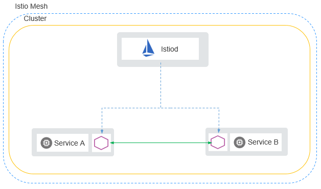

**托管网格**

托管网格将网格的控制面组件从用户集群中分离，部署到一个独立的控制面集群中，简化了用户运维负担和资源消耗，用户只需要基于网格进行服务管理。托管网格还能够对 N \( N\>=1\)个集群进行管理，支持服务跨集群通信。

**图 2**  托管网格  
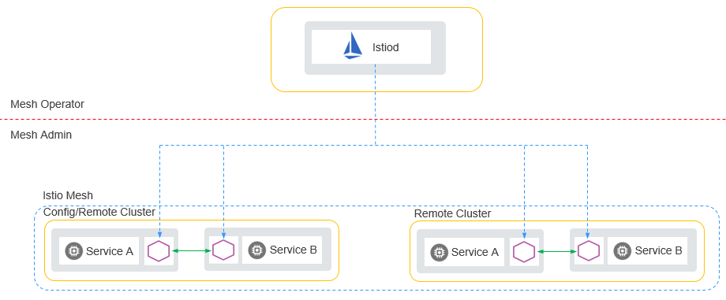

托管网格支持用户集群通过公网连接和私网连接两种方式连接网格控制面。

-   公网连接主要用于跨region添加集群。

    通过公网连接网格控制面，用户需要为集群绑定公网弹性IP（EIP），因为网格的控制面需要访问用户集群的kube-apiserver服务。还需要为集群所在的VPC创建公网NAT网关，因为服务的envoy组件需要通过NAT网关连接网格的控制面。

    **图 3**  公网连接网格控制面  
    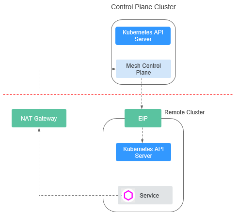

-   私网连接用于对接华为云region内部的集群。

    私网连接网格控制面则是利用VPC间的对等连接功能，打通了不同VPC之间的网络隔离。在创建网格时，要提前规划控制面的网段。

    **图 4**  私网连接网格控制面  
    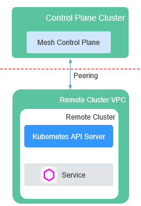

**传统跨集群访问**

用户需要创建NodePort或Loadbalancer服务、绑定ELB、配置转发端口，而且对每一个需要跨集群访问的服务都要执行此操作。除此之外，用户还需要维护各个服务的对外访问配置。

**图 5**  传统跨集群访问  
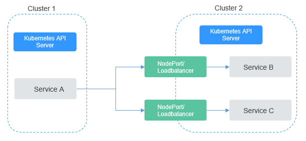

**ASM跨集群访问**

ASM托管网格提供的服务跨集群访问能力，不需要用户进行复杂的配置，只需要将集群和服务加入网格，加入网格的任何服务之间都是能够相互访问的，不管服务属于哪个集群。

**图 6**  ASM跨集群访问  
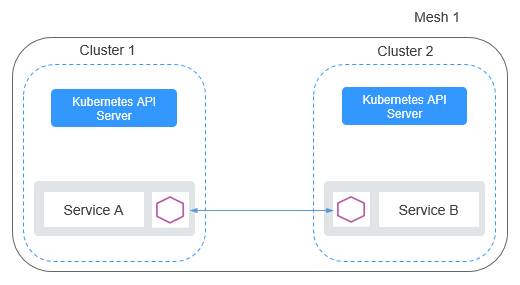

**扁平网络**

是指两个集群的实例（Pod）能够通过Pod IP互相访问。这对集群的网络模型有比较高的要求，使用的限制也比较多。首先，集群必须使用“容器对接ENI”的网络模型，才能够实现实例（Pod）之间通过IP访问。其次，多个集群要处于同一VPC，或多个集群的VPC通过其他方式（对等连接等）打通。而且，集群的网络要有统一的规划，多个集群的子网网段、容器网段、服务网段都不能冲突。

**图 7**  扁平网络  
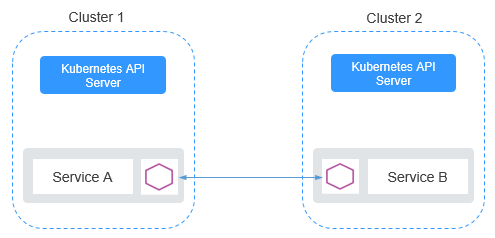

**非扁平网络**

是指两个集群内部实例（Pod）之间不能互相访问，必须通过一个对外网关转发。相比于扁平网络，非扁平网络具有更好的适用性。它对用户集群的网络模型没有特别的要求，用户集群只需要将Gateway地址暴露出来，供其他集群访问。但是因为使用集中的流量入口，性能瓶颈主要集中在网关上，而且多一次的转发，会对性能产生一定的影响。

**图 8**  非扁平网络  
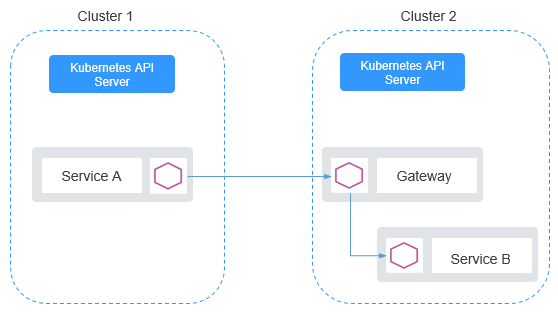

## 购买托管网格

网格控制面完全托管，全方位简化用户运维负担和资源消耗。用户只需基于网格进行服务管理即可。可以管理多云混合云场景的多集群，支持容器、虚拟机、物理机等多种基础设施的服务。

1.  登录[应用服务网格控制台](https://console.huaweicloud.com/istio/?locale=zh-cn)，在“总览”页单击“购买网格”进入购买Istio服务网格页面。
2.  网格类型选择“托管网格”。
3.  设置托管网格参数。
    -   计费模式

        当前可支持包年/包月和按需计费模式。包年/包月创建后不能删除，如需停止使用，请到费用中心执行退订操作。

    -   区域

        指在同一区域下，电力、网络隔离的物理区域，可用区之间内网互通，不同可用区之间物理隔离。如果您需要提高工作负载的高可靠性，建议您将云服务器创建在不同的可用区。

    -   版本

        指定购买的Istio版本。

    -   网格名称

        新建服务网格的名称，取值必须以小写字母开头，由小写字母、数字、中划线\(-\)组成，且不能以中划线\(-\)结尾。

    -   网格管理规模

        服务网格管理的实例规模。

        > **说明：** 
        >当前服务网格支持管理的最大pod实例数量，请根据业务需求选择，如需支持5000实例以上，请联系管理员。

    -   网格控制面网段

        > **说明：** 
        >此参数在网格创建后不可更改，请谨慎选择。

        网格控制面网段的掩码固定为22位，推荐使用子网10.253.0.0/22、172.31.0.0/22。建议从10.2.0.0/16\~10.246.0.0/16，10.248.0.0/16\~10.255.0.0/16，172.17.0.0/16\~172.31.0.0/16覆盖范围中选取一个掩码为22的子网，不推荐使用192.168.0.0/16、172.16.0.0/16、 10.0.0.0/16、10.1.0.0/16、10.247.0.0/16覆盖范围内的22位掩码子网，因为很容易与用户集群环境中网段冲突。

    -   购买时长

        网格购买时长，购买的时间越长越优惠。

        > **说明：** 
        >-   仅包年/包月的计费模式可设置购买时长，按需计费模式不支持。
        >-   按需计费的托管网格购买成功后即开始计费。
        >-   按需计费的托管网格治理不足20实例时，按20实例数收取费用，超过20实例时，按实际实例数收取费用。

4.  设置完成后，单击“下一步”。确认订单无误后，单击“提交”。

    启用时间预计需要5分钟，您可以单击请求提交页面的“返回Istio管理“或“前往CCE集群管理“查看Istio运行状态。

    > **说明：** 
    >购买后，会进行启用Istio的操作，期间会操作如下资源：
    >-   创建一个Helm应用编排release对象，作为Istio控制面的资源 。
    >-   开通ECS节点的安全组，允许7443端口的入流量，使其支持对Pod进行自动注入。
    >-   为该集群的default的命名空间打上inject=true标签。

5.  查看Istio服务网格是否启用成功。

    在应用服务网格控制台，单击左侧导航栏中的“网格管理”，如果网格状态为“运行中”表明启用Istio成功。

    **图 9**  Istio服务网格启用成功  
    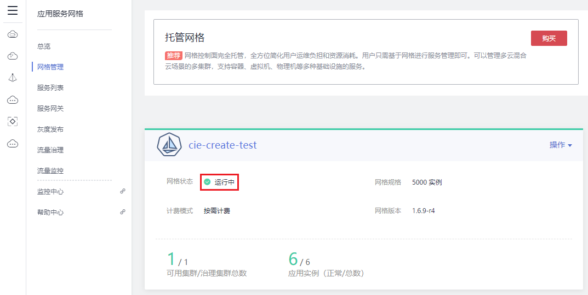

## 添加集群到托管网格

托管网格支持对多个集群进行管理，且支持服务跨集群通信。

1.  登录[应用服务网格控制台](https://console.huaweicloud.com/istio/?locale=zh-cn)，在左侧导航栏中选择“网格管理”。
2.  在右侧页面，单击对应网格中的“操作 \> 添加集群”。
3.  选择集群，设置集群信息。
    -   **选择集群**
        -   目前支持v1.15.x及以上版本的集群加入托管网格。
        -   同一虚拟私有云的集群只能加入同一个网格。
        -   为了满足高可用的要求，集群需要至少包含两个可用节点，每个节点至少保证有2U4G的可用资源。
        -   如果实例（Pod）需要跨集群通信，集群需要使用ENI网络模型，且集群之间网络互通（建议集群处于同一VPC内）。
        -   集群的服务网段、容器网段不能和网格内已有集群的服务网段、容器网段冲突。
        -   如果集群和网格内的已有集群处于不同的VPC，集群的子网网段也不能冲突。

    -   **选择连接方式**
        -   公网访问：需要为集群绑定公网弹性IP（EIP），因为网格的控制面需要访问用户集群的kube-apiserver服务。同时还需要为集群所在的VPC创建公网NAT网关，因为服务的envoy组件需要通过NAT网关连接网格的控制面。

            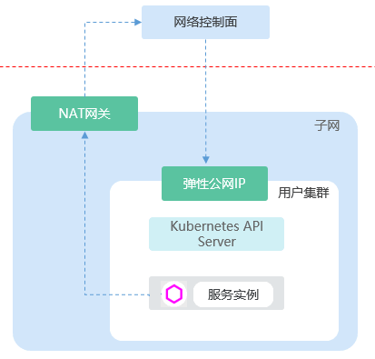

        -   私网访问：利用VPC间的对等连接功能，打通了不同VPC之间的网络隔离。

            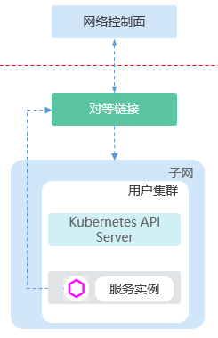

4.  设置完成后，单击“确定”。

    添加集群大约需要一分钟，请耐心等待。添加完成后，单击“返回网格详情”页面可查看到添加的集群信息。

    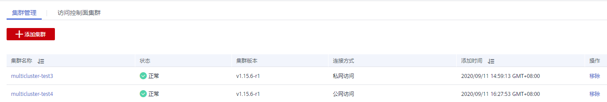

## 购买专有网格

在集群中一键启用，自动在集群中安装网格控制面，对集群内服务进行非侵入的治理、遥测和安全等管理。兼容Kubernetes和Istio生态。

1.  登录[应用服务网格控制台](https://console.huaweicloud.com/istio/?locale=zh-cn)，在“总览”页单击“购买网格”进入购买Istio服务网格页面。
2.  网格类型选择“专有网格”。
3.  设置服务选择参数。
    -   **计费模式**

        支持“按需计费“和“包年/包月“模式。包年/包月模式的节点创建后不能删除，如需停止使用，请到[费用中心](https://account.huaweicloud.com/usercenter/#/userindex/retreatManagement)执行退订操作。

    -   **当前区域**

        指节点实例所在的物理位置。请就近选择靠近您业务的区域，可减少网络时延，提高访问速度；不同区域的云服务产品之间内网互不相通。

    -   **集群**

        选择要启用Istio服务网格功能的集群。

    -   **版本**

        指定购买的Istio版本。

    -   **网格管理规模**

        > **说明：** 
        >-   当前服务网格支持管理的最大pod实例数量，请根据业务需求选择，如需支持5000实例以上，请联系管理员。
        >-   按需计费模式，当前可享受20实例的体验。

    -   **购买时长**

        > **说明：** 
        >-   仅包年/包月的计费模式可设置购买时长，按需计费模式不支持。
        >-   按需计费的托管网格当前可体验20实例。
        >-   按需计费的托管网格治理不足20实例时，按20实例数收取费用，超过20实例时，按实际实例数收取费用。

4.  设置完成后，单击“下一步”，配置“创建节点”参数。
    -   **高可用**

        Istio启用后，高可用模式与普通模式不可切换，请根据实际使用情况选择。

        -   是：高可用模式要求独享节点个数不少于2，用于Istio控制面多实例部署，多实例能大大的提高Istio控制面可靠性，推荐使用。
        -   否：非高可用模式为单点模式，Istio控制面组件均为单实例，无法提供更高的可靠性保证。

    -   **节点配置**

        此处为节点配额提示，如需申请更多配额，请单击申请扩大配额。

        -   **可用区**&**规格**

            指在同一区域下，电力、网络隔离的物理区域，可用区之间内网互通，不同可用区之间物理隔离。如果您需要提高工作负载的高可靠性，建议您将云服务器创建在不同的可用区。

            选择所需的规格。为确保Istio控制面运行稳定，推荐您使用 8U 16G 或以上规格控制面节点，详情请参见[规格推荐](https://support.huaweicloud.com/productdesc-istio/istio_productdesc_0006.html)。

    -   **登录方式**

        支持密码和密钥两种方式。

        -   选择“密码“：用户名默认为“root”，请输入登录节点的密码，并确认密码。

            登录节点时需要使用该密码，请妥善管理密码，系统无法获取您设置的密码内容。

        -   选择“密钥对“：在选项框中选择用于登录本节点的密钥对，并单击勾选确认信息。

            密钥对用于远程登录节点时的身份认证。如果没有密钥对，可单击选项框右侧的“创建密钥对”来新建，创建密钥对操作步骤请参见[创建密钥对](https://support.huaweicloud.com/usermanual-ecs/zh-cn_topic_0014250631.html)。

5.  设置完成后，单击“下一步”。确认订单无误后，单击“提交”。

    启用时间预计需要5分钟，您可以单击请求提交页面的“返回Istio管理“或“前往CCE集群管理“查看Istio运行状态。

    > **说明：** 
    >购买后，会进行启用Istio的操作，期间会操作如下资源：
    >-   如果为高可用，则创建需要至少2个ECS节点，作为Istio控制面运行节点。
    >-   创建一个Helm应用编排release对象，作为Istio控制面的资源 。
    >-   开通ECS节点的安全组，允许7443端口的入流量，使其支持对Pod进行自动注入。
    >-   为该集群的default的命名空间打上inject=true标签。

6.  查看Istio服务网格是否启用成功。

    在应用服务网格控制台，单击左侧导航栏中的“网格管理”，如果网格状态为“运行中”表明启用Istio成功。

    **图 10**  Istio服务网格启用成功  
    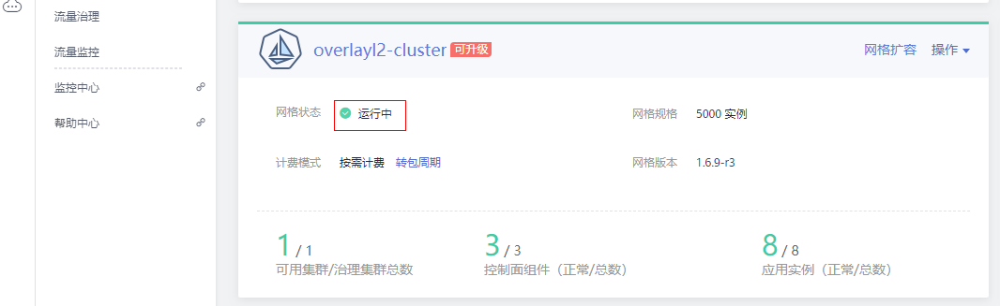

## 访问控制面集群

1.  登录[应用服务网格控制台](https://console.huaweicloud.com/istio/?locale=zh-cn)，单击左侧导航栏的“网格管理”。
2.  单击托管网格的名称，进入网格详情页面。
3.  在“访问控制面集群”页签，参照界面提示完成对应配置。

    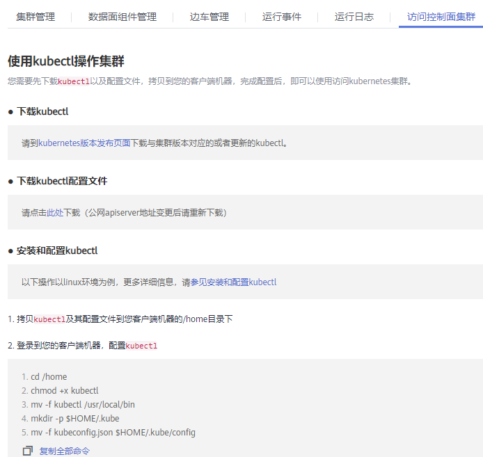

## 卸载服务网格

包周期的网格不支持直接卸载，请单击“更多 \> 退订”到订单中心处理。卸载服务网格前，请确保已移除全部集群。如果集群启用了包周期的网格，集群被删除后，服务网格仍然会继续计费，请前往订单处理中心手动退订。

1.  登录[应用服务网格控制台](https://console.huaweicloud.com/istio/?locale=zh-cn)，单击左侧导航栏的“网格管理”，在对应的服务网格下单击“操作 \> 卸载”。
2.  在卸载Istio服务网格页面，单击“确定”，执行卸载操作。

    -   卸载Istio服务网格将会卸载Istio控制面组件及数据面sidecar，卸载期间将自动为您重启业务pod，期间可能造成断服。
    -   卸载后，应用的对外访问方式将无法继续使用，请将旧的对外访问方式改为用service方式对外发布。
    -   如需查看节点信息，请至“CCE界面资源管理 \> 节点管理 \> 节点列表”中查看节点。
    -   如需更新对外访问方式，请至“CCE界面资源管理 \> 网络管理 \> 添加service”暴露对外访问方式。
    -   卸载Istio时，请确保集群中有可用节点，用于运行清理任务，否则将导致卸载失败。

    > **须知：** 
    >退订或卸载时将自动为您清理istio独享节点的相关标签，但不会删除istio-master节点，需要用户在CCE界面手动删除或退订，避免资源浪费。

## 网格扩容

添加节点不会增加istio控制面组件实例数，如有需要，请在节点添加完成后至控制面管理页扩容。

1.  登录[应用服务网格控制台](https://console.huaweicloud.com/istio/?locale=zh-cn)，单击左侧导航栏的“网格管理”，在对应的服务网格中单击“网络扩容”。
2.  在“运行节点”页签，单击“添加节点”，设置“创建节点”参数。
    -   **计费模式**

        -   包年/包月：包年包月是预付费模式，按订单的购买周期计费，适用于可预估资源使用周期的场景，价格比按需计费模式更优惠。
        -   按需计费：按需计费是后付费模式，按资源的实际使用时长计费，可以随时开通/删除资源。

        包年/包月节点创建后不能删除，如需停止使用，请到费用中心执行退订操作。

    -   **当前区域**

        指节点实例所在的物理位置。请就近选择靠近您业务的区域，可减少网络时延，提高访问速度；不同区域的云服务产品之间内网互不相通。

    -   **节点配置**

        此处为节点配额提示，如需申请更多配额，请单击申请扩大配额。

        -   **可用区**&**规格**

            指在同一区域下，电力、网络隔离的物理区域，可用区之间内网互通，不同可用区之间物理隔离。如果您需要提高工作负载的高可靠性，建议您将云服务器创建在不同的可用区。

            选择所需的规格。为确保Istio控制面运行稳定，推荐您使用 8U 16G 或以上规格控制面节点，详情请参见[规格推荐](https://support.huaweicloud.com/productdesc-istio/istio_productdesc_0006.html)。

    -   **登录方式**

        支持密码和密钥两种方式。

        -   选择“密码“：用户名默认为“root”，请输入登录节点的密码，并确认密码。

            登录节点时需要使用该密码，请妥善管理密码，系统无法获取您设置的密码内容。

        -   选择“密钥对“：在选项框中选择用于登录本节点的密钥对，并单击勾选确认信息。

            密钥对用于远程登录节点时的身份认证。如果没有密钥对，可单击选项框右侧的“创建密钥对”来新建，创建密钥对操作步骤请参见[创建密钥对](https://support.huaweicloud.com/usermanual-ecs/zh-cn_topic_0014250631.html)。

3.  设置完成后，单击“下一步”。确认信息无误后，单击“提交”。

