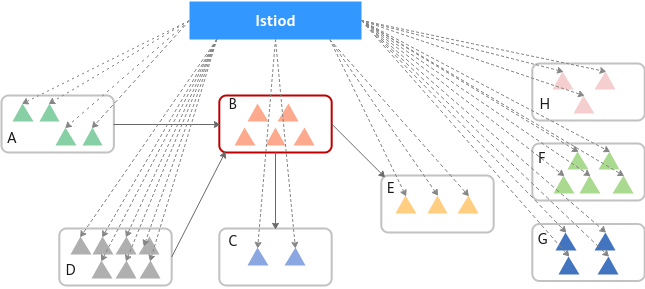

# 大规格实例优化

当网格内实例规模持续增大时，会引起Istio控制面组件Istiod和数据面组件Envoy的内存飙升问题。在购买网格时，可以为网格启用Mantis插件来解决此问题。

> **说明：** 
>大规格实例优化特性仅在“华东-上海一”区域开放。

## Mantis插件介绍

Mantis致力于解决由网格内实例规模增大而引起的Istio控制面组件Istiod和数据面组件Envoy的内存飙升问题。同时，从多个维度输出了Istio相关性能模型，填补了Istio在大规模实例场景下的性能模型空白，为Istio性能提升提供了有力支撑。

-   **提高控制面Istiod稳定性**

    Istio采用的是全局更新配置信息策略，如下图所示，当服务B的相关信息发生变化时，Istiod会生成全量xds并推送给网格内所有Proxy，这会导致Istiod的瞬时CPU、内存占用过高，可能导致Istiod重启。

    

    Mantis根据服务依赖关系按需更新配置，当服务B的相关信息发生变化时，Istiod会将服务B相关的更新推送给调用服务B的相关服务（服务A和服务D）的所有Endpoint中，包括生成配置和下发配置，可极大缓解Istiod CPU、内存占用过高的问题，提高控制面的稳定性。

    

-   **减小数据面sidecar资源消耗**

    Istio使用Envoy作为网格数据面的sidecar。目前Istio采用的是全局更新配置信息策略，即网格内每一个实例中的Envoy都储存了网格内其他所有服务的相关信息，包括listener、route、cluster和endpoint。这在实例规模不断增大的情况下，将会发生内存爆炸，在实际生产环境中是不可接受的。

    

    Mantis根据服务依赖关系按需更新配置，即每一个实例的Envoy只存储和本服务需要调用的服务的相关信息，可以将Envoy的内存占用最小化。

    

## Mantis工作原理

Mantis的架构和工作流程如下图所示：

网格安装Mantis后，会在用户集群安装CentralGateway（CGW）组件。CGW包含网格全局的服务路由信息，用于转发首包流量；网格控制面会根据服务调用关系按需更新服务路由信息。

网格安装初始化完成后，所有服务实例（Pod）的Envoy中只存储了CGW组件的路由信息。

1.  当某个服务Service A的实例（Pod）第一次访问另一个服务Service B时，由于Service A实例的Envoy中没有Service B的路由信息，Envoy会将请求发送到CGW上。
2.  CGW保存了网格全局的服务路由信息，所以CGW可以将请求转发到Service B的实例。
3.  同时，CGW会将Service B的路由信息上报到Mantis控制面。
4.  然后再由Mantis控制面下发给Service A的所有实例。
5.  在后续Service A访问Service B时，由于Service A所有实例的Envoy中已经存在Service B的路由信息，请求将会被直接转发给Service B的实例。

而对于Service A未访问过的服务，Service A所有实例的Envoy中不会存储服务的路由信息，可以有效减小Envoy内存消耗。

## Mantis使用约束

-   启用Mantis插件对网格有如下限制：

    企业版网格，1.8.4-r4及以上网格版本，扁平网络拓扑。

-   Mantis插件仅针对HTTP协议的服务做优化。
-   安装Mantis插件后，暂时不支持卸载。
-   安装Mantis插件的网格升级时，会同步升级Mantis插件。
-   启用Mantis插件后，如有访问外部服务的需求，需要为集群所在VPC子网配置NAT网关。

