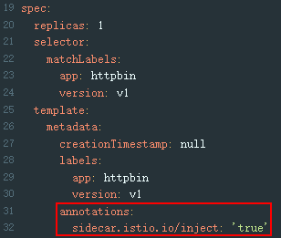
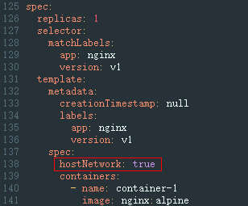

# 所有Pod是否都注入了sidecar<a name="asm_01_0063"></a>

## 问题描述<a name="section146041745338"></a>

Service管理的所有Pod都必须存在istio-proxy容器，否则报此异常。

## 修复指导<a name="section1457519694110"></a>

1.  登录ASM控制台，选择服务所在网格。单击左侧导航中的“网格配置”，选择“sidecar管理”页签，检查服务所在命名空间是否已注入sidecar。
    -   否，执行[2](#li1665121115612)。
    -   是，执行[3](#li127525055610)。

2.  <a name="li1665121115612"></a>注入sidecar。

    可参考[sidecar注入](sidecar管理.md#section65931513505)，为命名空间下所有工作负载关联的Pod注入sidecar。或者只为某个工作负载注入sidecar，方法如下：

    1.  为工作负载所在命名空间打上istio-injection=enabled标签。

        **kubectl label ns**  <namespace\>  **istio-injection=enabled**

    2.  在CCE控制台为工作负载添加annotations字段。

        ```
              annotations:
                sidecar.istio.io/inject: 'true'
        ```

        

    您可以单击[Installing the Sidecar](https://istio.io/latest/docs/setup/additional-setup/sidecar-injection/)了解更多sidecar注入的知识。

3.  <a name="li127525055610"></a>如果网格已经开启了命名空间注入，但是Pod未注入sidecar，需要在CCE控制台手动重启Pod。方法如下：

    登录CCE控制台，在工作负载所在行，单击操作列的“更多 \> 重新部署”。

4.  检查工作负载是否配置了主机网络模式。方法如下：

    登录CCE控制台，在工作负载所在行，单击操作列的“更多 \> 编辑YAML”，查看是否配置了spec.template.spec.hostNetwork: true。如果是，请确认是否可将该字段删除或者配置为false，否则不允许注入sidecar。

    

5.  检查网格实例数量是否已经超出套餐配额。

