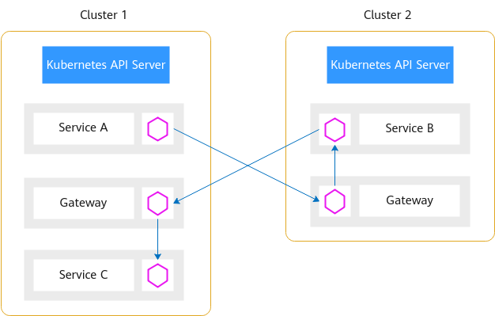

# 扁平网络和非扁平网络

企业版网格所管理的用户集群，根据他们的网络类型，可以分为扁平网络和非扁平网络。

## 扁平网络

扁平网络指的是两个或多个Kubernetes集群的Pod之间能够直接访问，而无需通过其他组件转发，能够提供更高的通信效率。

**图 1**  扁平网络  

使用扁平网络对Kubernetes集群的网络模型、网络连通性、规划网段有一定的约束：

-   所有集群必须使用容器对接ENI的网络模型，通过VPC的路由实现Pod之间跨集群通信。支持CCE集群和CCE Turbo集群。如果使用CCE集群，在创建时，网络模型需要选择“VPC网络”；如果使用CCE Turbo集群，在创建时，网络模型需要选择“云原生网络2.0”。

    > **说明：** 
    >集群的网络类型可参考：[集群网络构成](https://support.huaweicloud.com/usermanual-cce/cce_01_0010.html#cce_01_0010__section1131733719195)。

-   所有集群VPC之间需要互通，可以处于同一VPC内，也可以将多个集群的VPC通过其他方式（对等连接、云连接等）连通。如果集群处于不同VPC内，要注意VPC的网段之间不要冲突。

    > **说明：** 
    >对等连接可参考：[创建同一帐户下的对等连接](https://support.huaweicloud.com/usermanual-vpc/zh-cn_topic_0046655037.html)。
    >云连接可参考：[同区域同帐号VPC互通](https://support.huaweicloud.com/qs-cc/cc_02_0101.html)。

-   所有集群要有统一的网络规划，所有集群的容器网段、服务网段之间不能冲突。如果多个集群处于不同VPC，那么所有集群的VPC网段也不能冲突。同时，以上网段不能和网格控制面网段冲突。

## 非扁平网络

非扁平网络指的是两个或多个Kubernetes集群的Pod之间因为网络模型不支持、容器网段冲突等原因无法直接通信，而是通过一个东西向流量的转发网关，实现非扁平网络集群间的通信。

**图 2**  非扁平网络  

相比于扁平网络，非扁平网络的使用约束少：

-   所有集群VPC之间的网络需要互通，可以处于同一VPC内，也可以将多个集群的VPC通过其他方式（对等连接、云连接等）连通。

    > **说明：** 
    >对等连接可参考：[创建同一帐户下的对等连接](https://support.huaweicloud.com/usermanual-vpc/zh-cn_topic_0046655037.html)。
    >云连接可参考：[同区域同帐号VPC互通](https://support.huaweicloud.com/qs-cc/cc_02_0101.html)。

-   非扁平网络对用户集群的网络模型没有特别的要求，用户集群只需要将Gateway地址暴露出来，供其他集群访问即可。但是因为使用集中的流量入口，性能瓶颈主要集中在网关上，而且多一次的转发，会对通信时延产生一定的影响。

在ASM控制台为网格添加集群时，需要为集群配置一个东西向流量的私网ELB，作为其他集群的访问入口。

**图 3**  添加集群  

## 选型对比

**表 1**  网络类型对比

<table><thead align="left"><tr id="zh-cn_topic_0000001187648536_row1211511444353"><th class="cellrowborder" valign="top" width="19.501950195019504%" id="mcps1.2.4.1.1">
网络类型

</th>
<th class="cellrowborder" valign="top" width="39.16391639163916%" id="mcps1.2.4.1.2">
优点

</th>
<th class="cellrowborder" valign="top" width="41.334133413341334%" id="mcps1.2.4.1.3">
缺点

</th>
</tr>
</thead>
<tbody><tr id="zh-cn_topic_0000001187648536_row711554443510"><td class="cellrowborder" valign="top" width="19.501950195019504%" headers="mcps1.2.4.1.1 ">
扁平网络

</td>
<td class="cellrowborder" valign="top" width="39.16391639163916%" headers="mcps1.2.4.1.2 "><ul id="zh-cn_topic_0000001187648536_ul1628692713369"><li>跨集群通信效率高</li><li>跨集群通信不存在转发性能瓶颈</li></ul>
</td>
<td class="cellrowborder" valign="top" width="41.334133413341334%" headers="mcps1.2.4.1.3 "><ul id="zh-cn_topic_0000001187648536_ul992916207373"><li>对集群网络模型有要求</li><li>对集群服务网段、容器网段有要求</li></ul>
</td>
</tr>
<tr id="zh-cn_topic_0000001187648536_row3115844173514"><td class="cellrowborder" valign="top" width="19.501950195019504%" headers="mcps1.2.4.1.1 ">
非扁平网络

</td>
<td class="cellrowborder" valign="top" width="39.16391639163916%" headers="mcps1.2.4.1.2 "><ul id="zh-cn_topic_0000001187648536_ul132281544363"><li>对集群网络模型没有要求</li><li>对集群服务网段、容器网段没有要求</li></ul>
</td>
<td class="cellrowborder" valign="top" width="41.334133413341334%" headers="mcps1.2.4.1.3 "><ul id="zh-cn_topic_0000001187648536_ul81980289380"><li>跨集群通信经过一次额外的转发，效率降低</li><li>跨集群通信经过东西向流量网关，存在转发性能瓶颈</li></ul>
</td>
</tr>
</tbody>
</table>

## 扁平网络和非扁平网络集群混合场景

**图 4**  扁平网络和非扁平网络混合部署  

为了减少运维负担，不建议扁平网络和非扁平网络的集群混合加入ASM网格中，如果必须混合部署，有以下使用约束：

-   所有扁平网络的集群必须使用容器对接ENI的网络模型，对非扁平网络的集群没有特殊要求。
-   所有集群VPC之间的网络需要互通，可以处于同一VPC内，也可以将多个集群的VPC通过其他方式（对等连接、云连接等）连通。如果集群处于不同VPC内，要注意VPC的网段之间不要冲突。

    > **说明：** 
    >对等连接可参考：[创建同一帐户下的对等连接](https://support.huaweicloud.com/usermanual-vpc/zh-cn_topic_0046655037.html)。
    >云连接可参考：[同区域同帐号VPC互通](https://support.huaweicloud.com/qs-cc/cc_02_0101.html)。

-   所有集群（包括非扁平网络）的容器网段、服务网段之间不能冲突。例如：混合网络拓扑场景下，CCE集群Cluster1为扁平网络拓扑，CCE集群Cluster2为非扁平网络拓扑，那么Cluster1的容器网段、服务网段不能和Cluster2的容器网段、服务网段冲突，即使Cluster2集群为非扁平网络拓扑。

    如果多个集群处于不同VPC，那么所有集群的VPC网段也不能冲突。同时，以上网段不能和网格控制面网段冲突。

