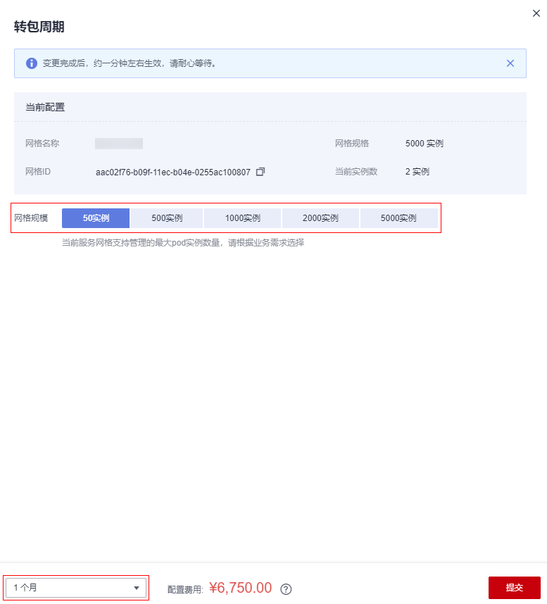

# 按需转包周期

## 操作场景

-   包年/包月是预付费模式，按订单的购买周期计费，适用于可预估资源使用周期的场景，价格比按需计费模式更优惠。
-   按需计费是后付费模式，按资源的实际使用时长计费，可以随时开通/删除资源。

> **说明：** 
>“包年/包月”计费模式的网格也称“包周期”网格。

如果您需要长期使用当前网格，可以将按需购买的网格转为包周期计费模式，节省开支。

## 约束与限制

由于基础版网格免费，按需转包周期仅适用于企业版或专有版网格。

## 操作步骤

1.  登录[应用服务网格控制台](https://console.huaweicloud.com/asm/?locale=zh-cn)，在对应的按需计费网格下单击“转包周期”。
2.  选择网格规模和计费周期，单击“提交”。

    **图 1**  转包周期  
    

    > **说明：** 
    >可选的网格规模受限于当前实例数。例如，企业版按需计费网格的规格为5000实例，转包周期时，如果当前实例数为550，则只能选择超过550实例的网格规模，如1000、2000、5000。

3.  选择支付方式后，单击“确认付款”。

    变更完成后，约一分钟左右生效，请耐心等待。

