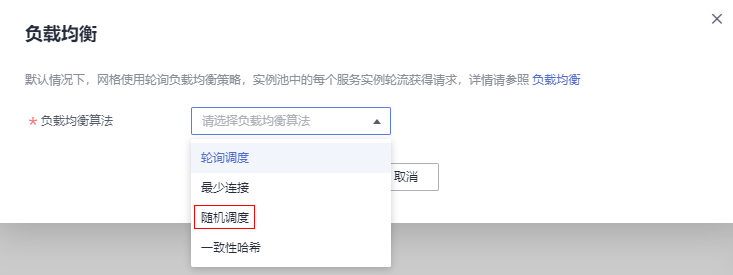

# 更改流量策略

## 操作场景

流量策略设置完成后，支持更改流量策略，如将负载均衡的算法由“轮询调度“转为“随机调度“。

## 操作步骤

1.  登录[应用服务网格控制台](https://console.huaweicloud.com/asm/?locale=zh-cn)，单击服务网格的名称，进入网格详情页面。
2.  在左侧导航栏选择“服务管理“，选择需要更改流量策略的服务，单击操作列的“流量治理“，在右侧页面进行流量策略更改。

    接下来，我们将以[Bookinfo应用](https://support.huaweicloud.com/qs-asm/asm_qs_0001.html#section1)的reviews服务为例，结合APM（应用性能管理）的监控拓扑图来描述负载均衡算法更改前后的配置效果。

    1.  负载均衡算法为“轮询调度”时，不断访问productpage页面，观察流量如何分发。

        进入“流量监控”页面，鼠标右键单击reviews服务，选择“展开”选项，这时我们可以看到所有实例的被分发情况。

        

        从下图可以看出，请求依次分发给reviews的5个实例。这与负载均衡“轮询调度”算法相吻合。

        

    2.  在“负载均衡”页签中，单击“立即配置”，将负载均衡算法修改为“随机调度”。

        **图 1**  修改负载均衡算法  
        

    3.  不断访问productpage页面，观察流量分发情况。

        

        可以发现流量分发没有什么固定规律，各个实例的访问次数参差不齐，说明随机算法已经生效。

