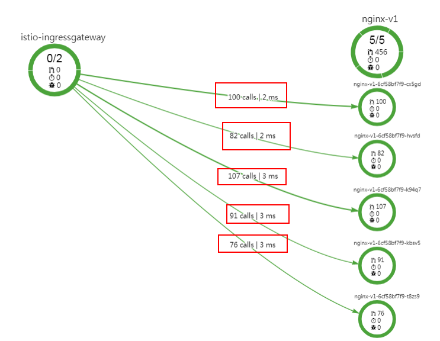

# 更改流量策略算法

流量策略设置完成后，支持更改流量策略算法，如将负载均衡的算法由“轮询调度“转为“随机调度“。

1.  登录应用服务网格控制台，选择需要更改流量策略的网格名称，在左侧导航栏中选择“服务管理“。
2.  选择需要更改流量策略的服务，单击操作列的“流量治理“，在右侧页面进行流量策略更改。
3.  在“负载均衡”中，单击右侧的“配置“，在弹出的“负载均衡“页面更改算法为“随机调度“，单击“确定“。

    **图 1**  修改负载均衡算法  
    

4.  重复先前的操作，在流量监控里观察请求分发情况。

    可以发现流量分发没有什么固定规律，各个实例差距也比较大，说明随机算法已经生效。

    **图 2**  随机算法结果  
    

