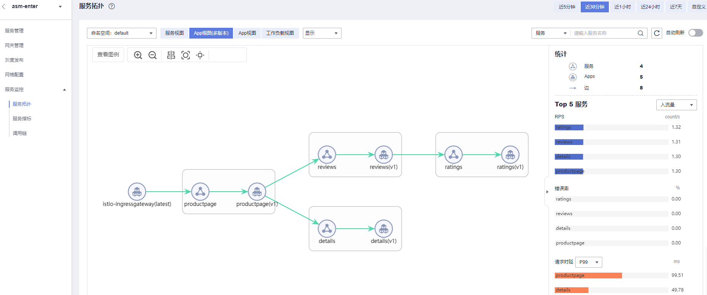

# 服务拓扑

服务拓扑图展示了当前项目下服务间的调用关系、调用时长和RPS等流量信息。流量监控记录的是组件过去24小时内的数据，所以当部分组件删除后并不能及时的在拓扑图上消失，而是会仍然存在一段时间。

## 查看服务拓扑大图

1.  登录[应用服务网格控制台](https://console.huaweicloud.com/asm/?locale=zh-cn)，选择已对接CIE服务的网格。
2.  在左侧导航栏中选择“服务监控 \> 服务拓扑”。
3.  可根据实际需求选择查看“App视图\(多版本\)”、“App视图”、“服务视图”、“工作负载视图”。

    **图 1**  服务拓扑  
    

    -   在拓扑图区域，可以看到各个流量分发到各个实例的情况。
    -   在页面右侧可以看到入流量、出流量和总流量的情况。
    -   鼠标单击拓扑图上的图标，可查看其详细信息。
    -   右上角可根据实际选择近5分钟、近30分钟、近1小时、近24小时、近7天或自定义时间粒度查看拓扑图。

