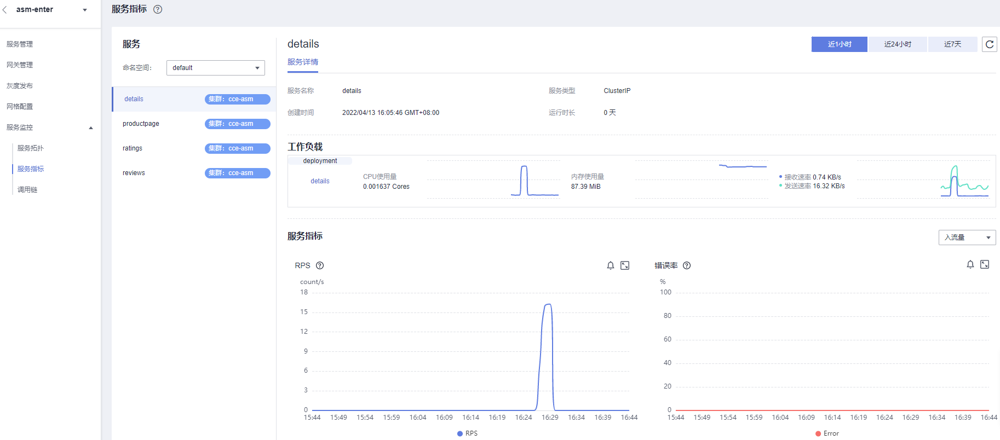

# 服务指标

提供服务指标统计功能，帮助您了解服务和操作的实时RPS、错误率、时延等关键指标。

## 查看服务指标

1.  登录[应用服务网格控制台](https://console.huaweicloud.com/asm/?locale=zh-cn)，选择已对接CIE服务的网格。
2.  在左侧导航栏，单击“服务监控 \> 服务指标”。
3.  在“服务详情”页签下，可查看服务详情信息，工作负载的CPU使用率、内存使用量、接收速率和发送速率，服务指标等信息。服务指标具体说明如[表1](#table94309121788)所示。

    在右上角也可设置查看服务流量的时间段，包括“近1小时”、“近24小时”和“近7天”。

    **图 1**  服务指标  
    

    **表 1**  服务指标

    
    <table><thead align="left"><tr id="row242981210810"><th class="cellrowborder" valign="top" width="31.319999999999997%" id="mcps1.2.3.1.1">
指标

    </th>
    <th class="cellrowborder" valign="top" width="68.67999999999999%" id="mcps1.2.3.1.2">
说明

    </th>
    </tr>
    </thead>
    <tbody><tr id="row14429012786"><td class="cellrowborder" valign="top" width="31.319999999999997%" headers="mcps1.2.3.1.1 ">
RPS

    </td>
    <td class="cellrowborder" valign="top" width="68.67999999999999%" headers="mcps1.2.3.1.2 ">
服务每秒接收的请求次数。

    </td>
    </tr>
    <tr id="row104298121181"><td class="cellrowborder" valign="top" width="31.319999999999997%" headers="mcps1.2.3.1.1 ">
错误率

    </td>
    <td class="cellrowborder" valign="top" width="68.67999999999999%" headers="mcps1.2.3.1.2 ">
错误请求的百分比。

    </td>
    </tr>
    <tr id="row13430912284"><td class="cellrowborder" valign="top" width="31.319999999999997%" headers="mcps1.2.3.1.1 ">
请求时延

    </td>
    <td class="cellrowborder" valign="top" width="68.67999999999999%" headers="mcps1.2.3.1.2 ">
服务端处理请求的耗时。

    <ul id="ul643051216820"><li>P99：响应时延从小到大排列，顺序处于99%位置的值即为P99值。</li><li>P95：响应时延从小到大排列，顺序处于95%位置的值即为P95值。</li><li>P50：平均响应时延（ms）。</li></ul>
    </td>
    </tr>
    </tbody>
    </table>

1.  在“服务指标”的区域，在曲线图中单击图标，可查看近1小时、近24小时、近3天、近7天或自定义时间段的服务指标。单击图标，可以添加PromQL阈值规则，当规则被触发后，将生成一条告警，便于您更快地发现、定位并恢复故障。更多内容请参见[CIE用户指南 \> 告警规则](https://support.huaweicloud.com/usermanual-cie/cie_01_0016.html)。

