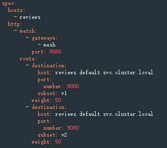
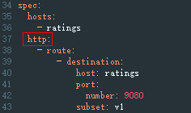
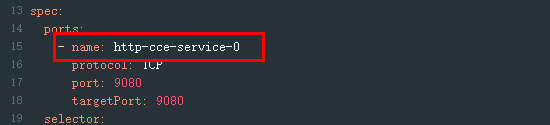

# 服务是否配置了默认版本的服务路由，路由配置是否正确

## 问题描述

Istio在VirtualService和DestinationRule中定义了服务的流量路由规则，所以需要为每个服务配置VirtualService和DestinationRule，需要满足以下的规则：

-   VirtualService中必须配置了Service的所有端口。
-   VirtualService中的协议类型必须和Service中端口协议类型一致。
-   VirtualService和DestinationRule中必须配置了默认的服务版本。

> **说明：** 
>如果检查结果发生改变，可能Service的端口号或端口名称被修改。

## 修复指导

1.  登录ASM控制台，选择服务所在网格，单击左侧导航中的“网格配置”，选择“istio资源管理”页签，在搜索框中选择“istio资源：virtualservices”及服务所属命名空间。
2.  确保VirtualService中必须配置了Service的所有端口。

    

3.  确保VirtualService中的协议类型必须和Service中端口协议类型一致。

    **图 1**  VirtualService的协议类型  
    

    **图 2**  Service的端口协议类型  
    

