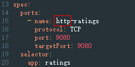

# 服务是否配置了默认版本的服务路由，路由配置是否正确

Istio在VirtualService和DestinationRule中定义了服务的流量路由规则，所以需要为每个服务配置VirtualService和DestinationRule，需要满足以下的规则：

-   VirtualServices中必须配置了Service的所有端口 。
-   VirtualServices中的协议类型必须和Service中端口协议类型一致 。

    > **说明：** 
    >-   VirtualService和DestinationRule中必须配置了默认的服务版本。
    >-   如果检查结果发生改变，可能Service的端口号或端口名称被修改。

## 修复指导

1.  登录ASM控制台，选择服务所在网格，单击“网格配置”，选择“istio资源管理”页签，选择“isitio资源：virtualService”及服务所属命名空间，确保VirtualServices中必须配置了Service的所有端口的route。

    .png)

2.  登录ASM控制台，选择服务所在网格，单击“网格配置”，选择“istio资源管理”页签，选择isitio资源：virtualService，确保VirtualServices中的协议类型必须和Service中端口协议类型一致。

    **图 1**  virtualService的协议类型  
    

    **图 2**  Service的端口协议类型  
    

