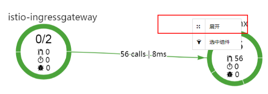
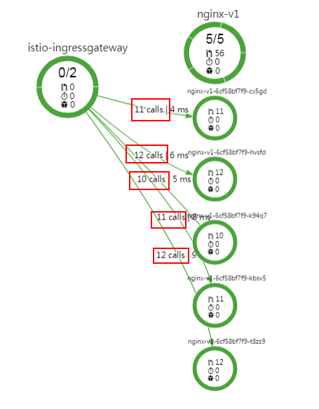

# 查看流量监控

轮询算法为默认负载均衡算法，即当组件有多个实例时，访问基本接近于平均分配给每一个实例。组件流量策略设置完成后，通过连续不中断的访问应用，产生访问数据。

1.  登录应用服务网格控制台，在左侧导航栏中选择“流量监控“。
2.  在上侧时间轴区域选择对应的时间范围，在所需要查看的组件区域右键单击“展开“，将其展开为版本。

    **图 1**  选择时间轴并展开组件  
    

3.  右键单击展开的版本，选择“展开“，将其展开为实例。

    > **说明：** 
    >Report模式下，不提供实例展开功能。

    **图 2**  展开组件为实例  
    

4.  在拓扑图区域，可以看到各个流量分发到各个实例的情况。

    **图 3**  轮询算法请求分发  
    

