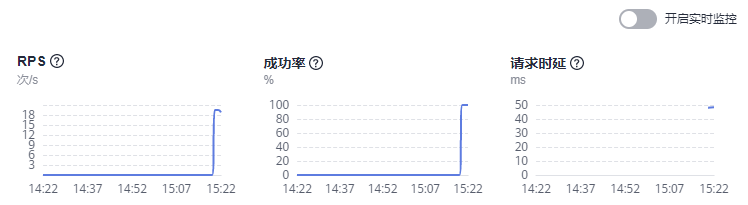

# 查看流量监控

## 操作场景

服务的流量治理页面支持查看近1小时内流量的监控数据，包括RPS、成功率和请求时延。

## 操作步骤

1.  登录[应用服务网格控制台](https://console.huaweicloud.com/asm/?locale=zh-cn)，单击服务网格的名称，进入网格详情页面。
2.  在左侧导航栏选择“服务管理”，在列表右上方选择服务所在命名空间。
3.  选择一个服务，单击操作列的“流量治理”，在右侧页面查看近1小时内流量的监控数据。

    **图 1**  流量监控  
    

4.  开启实时监控后，数据将进行每分钟动态刷新。

