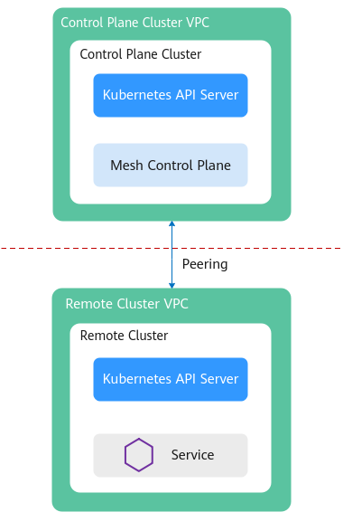
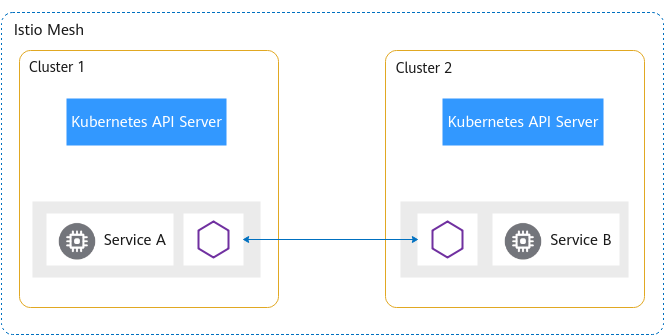

# 概述

启用服务网格，将为您的服务以无侵入的方式提供灵活的服务治理能力。您只需在CCE集群中开启应用服务网格功能，即可实现灰度发布、流量管理、熔断、监控、拓扑、调用链等丰富的服务治理能力。.

## 前提条件

已创建CCE集群，如果未创建，请参照[购买CCE集群](https://support.huaweicloud.com/usermanual-cce/cce_01_0028.html)创建。

## 使用须知

-   应用服务网格依赖集群coreDNS的域名解析能力，启用应用服务网格前请确保集群拥有足够资源，且coreDNS组件运行正常。
-   启用应用服务网格时，需要开通node节点所在安全组的入方向7443端口规则，用于sidecar自动注入回调。如果您使用CCE创建的默认安全组，此端口会自动开通。如果您自建安全组规则，请手动开通7443端口，以确保Istio自动注入能力正常。

## 基础版网格

在用户集群中安装网格的控制面组件，对集群内的服务进行非侵入式的治理、遥测和安全等管理。

> **说明：** 
>-   基础版支持Istio1.8及以上版本。
>-   当前只能够对一个集群进行管理。
>-   当前只支持50实例。

**图 1**  基础版  

## 企业版网格

企业版将网格的控制面组件从用户集群中分离，部署到一个独立的控制面集群中，简化了用户运维负担和资源消耗，用户只需要基于网格进行服务管理。企业版还能够对 N \( N\>=1\)个集群进行管理，支持服务跨集群通信。

**图 2**  企业版  

-   公网连接主要用于跨region添加集群。

    通过公网连接网格控制面，用户需要为集群绑定公网弹性IP（EIP），因为网格的控制面需要访问用户集群的kube-apiserver服务。还需要为集群所在的VPC创建公网NAT网关，因为服务的envoy组件需要通过NAT网关连接网格的控制面。

    **图 3**  公网连接网格控制面  
    

-   私网连接用于对接华为云region内部的集群。

    私网连接网络控制面则是利用VPC间的对等连接功能，打通了不同VPC之间的网络隔离。在创建网格时，要提前规划控制面的网段。

    **图 4**  私网连接网格控制面  
    

**传统跨集群访问**

用户需要创建NodePort或Loadbalancer服务、绑定ELB、配置转发端口，而且对每一个需要跨集群访问的服务都要执行此操作。除此之外，用户还需要维护各个服务的对外访问配置。

**图 5**  传统跨集群访问  

**ASM跨集群访问**

ASM企业版提供的服务跨集群访问能力，不需要用户进行复杂的配置，只需要将集群添加到网格，网格管理的所有集群的所有服务之间都是能够相互访问的，不管服务属于哪个集群。

**图 6**  ASM跨集群访问  

**扁平网络**

是指两个集群的实例（Pod）能够通过Pod IP互相访问。这对集群的网络模型有比较高的要求，使用的限制也比较多。首先，集群必须使用“容器对接ENI”的网络模型，才能够实现实例（Pod）之间通过IP访问。其次，多个集群要处于同一VPC，或多个集群的VPC通过其他方式（对等连接等）打通。而且，集群的网络要有统一的规划，多个集群的子网网段、容器网段、服务网段都不能冲突。

**图 7**  扁平网络  

**非扁平网络**

是指两个集群内部实例（Pod）之间不能互相访问，必须通过一个对外网关转发。相比于扁平网络，非扁平网络具有更好的适用性。它对用户集群的网络模型没有特别的要求，用户集群只需要将Gateway地址暴露出来，供其他集群访问。但是因为使用集中的流量入口，性能瓶颈主要集中在网关上，而且多一次的转发，会对性能产生一定的影响。

**图 8**  非扁平网络  

