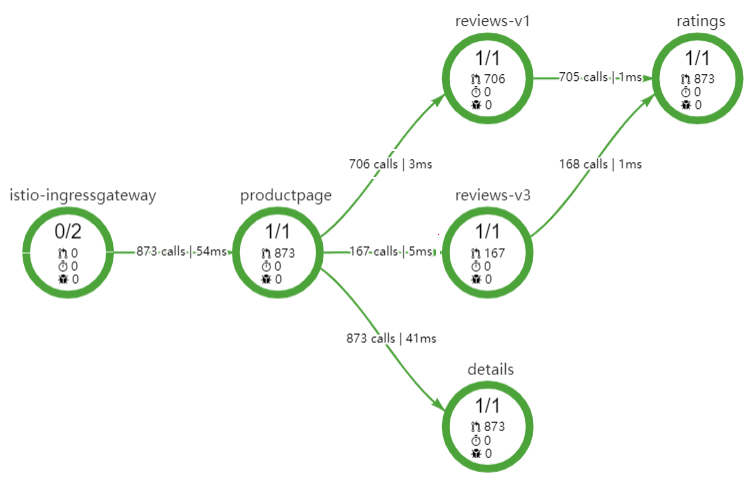

# 流量监控<a name="asm_01_0070"></a>

创建网格时，可观测性配置选择对接APM服务，可通过流量监控来监测流量概况、组件运行状态、调用链等信息，并在系统业务异常时快速定位到问题点。

## 约束与限制<a name="section193842114813"></a>

-   流量监控记录的是组件过去24小时内的数据，所以当部分组件删除后并不能及时的在拓扑图上消失，而是会仍然存在一段时间。
-   企业版网格多集群场景下，只支持集群内部服务之间的流量监控，暂时不支持跨集群服务之间的流量监控。

## 查看流量监控情况<a name="section788312464417"></a>

1.  登录[应用服务网格控制台](https://console.huaweicloud.com/asm/?locale=zh-cn)，选择已对接APM的服务网格。
2.  在左侧导航栏中选择“流量监控”。
3.  查看整个系统的监控情况。

    拓扑图中显示了系统处于运行中和未就绪的应用数量。

    **图 1**  流量拓扑<a name="fig139777507278"></a>  
    

4.  查看某个组件的监控情况。

    选择服务网格、集群及命名空间，单击拓扑图上的组件，进入组件监控详情页面，如[图2](#fig1379114375314)所示。

    **图 2**  流量监控详情页<a name="fig1379114375314"></a>  
    

    其中，

    -   流量概况：展示了应用详细的流量信息，包含请求总数、错误计数、平均时延、最大时延等。
    -   部署信息：显示了组件内的所有实例状态及信息。
    -   调用链：通过时间维度和组件版本来查看调用情况，支持使用高级搜索中的选项进行精准搜索。使用istio做服务治理时，无需在微服务代码中进行调用链埋点。但微服务代码在接收和发送请求时需要传递调用链相关的Header信息，才能构造成完整的调用链路，详情请参见[如何使用Istio调用链埋点](#section437112311448)。


## 如何使用Istio调用链埋点<a name="section437112311448"></a>

Header信息包括如下内容，更多关于调用链的信息请参见[https://istio.io/docs/tasks/telemetry/distributed-tracing/](https://istio.io/docs/tasks/telemetry/distributed-tracing/)。

-   x-request-id
-   x-b3-traceid
-   x-b3-spanid
-   x-b3-parentspanid
-   x-b3-sampled
-   x-b3-flags
-   x-ot-span-context

下面以一个典型的例子来说明如何在接收和发送请求时，通过修改代码来传递调用链相关Header信息。

-   **Python代码示例**

    服务接收端在处理请求时，从请求端解析相关Header。在调用后端请求时，传递Trace相关的header。

    ```
    def getForwardHeaders(request):
        headers = {}
    
    if 'user' in session:
        headers['end-user'] = session['user']
    
    incoming_headers = ['x-request-id',
        'x-b3-traceid',
        'x-b3-spanid',
        'x-b3-parentspanid',
        'x-b3-sampled',
        'x-b3-flags',
        'x-ot-span-context'
    ]
    
    return headers
    
    
    @ app.route('/productpage')
    def front():
        product_id = 0# TODO: replace
    default value
    headers = getForwardHeaders(request)
    user = session.get('user', '')
    product = getProduct(product_id)
    detailsStatus, details = getProductDetails(product_id, headers)
    reviewsStatus, reviews = getProductReviews(product_id, headers)
    return render_template(
        'productpage.html',
        detailsStatus = detailsStatus,
        reviewsStatus = reviewsStatus,
        product = product,
        details = details,
        reviews = reviews,
        user = user)
    ```

-   **Java代码示例**

    在java Rest接口上除了解析一般业务参数外，需要从header中解析trace相关信息。同样在调用下一个服务时传递该header信息。

    ```
    @GET
    @Path("/reviews/{productId}")
    public Response bookReviewsById(@PathParam("productId") int productId,
    @HeaderParam("end-user") String user,
    @HeaderParam("x-request-id") String xreq,
    @HeaderParam("x-b3-traceid") String xtraceid,
    @HeaderParam("x-b3-spanid") String xspanid,
    @HeaderParam("x-b3-parentspanid") String xparentspanid,
    @HeaderParam("x-b3-sampled") String xsampled,
    @HeaderParam("x-b3-flags") String xflags,
    @HeaderParam("x-ot-span-context") String xotspan) {
    	int starsReviewer1 = -1;
    	int starsReviewer2 = -1;
    	if (ratings_enabled) {
    		JsonObject ratingsResponse = getRatings(Integer.toString(productId), user, xreq, xtraceid, xspanid, xparentspanid, xsampled, xflags, xotspan);
    		if (ratingsResponse != null) {
    			if (ratingsResponse.containsKey("ratings")) {
    				JsonObject ratings = ratingsResponse.getJsonObject("ratings");
    				if (ratings.containsKey("Reviewer1")){
    					starsReviewer1 = ratings.getint("Reviewer1");
    				}
    				if (ratings.containsKey("Reviewer2")){
    					starsReviewer2 = ratings.getint("Reviewer2");
    				}
    			}
    		}
    	}
    	String jsonResStr = getJsonResponse(Integer.toString(productId), starsReviewer1, starsReviewer2);
    	return Response.ok().type(MediaType.APPLICATION_JSON).entity(jsonResStr).build();
    }
    }
    ```


