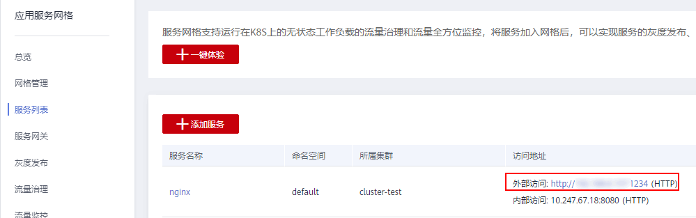

# 添加服务

Istio服务网格支持对运行在Kubernetes集群上的无状态工作负载进行流量治理和流量全方位监控，将服务加入网格后，可以实现服务的灰度发布、限流、熔断、会话保持等流量治理能力以及一站式、图形化拓扑的流量健康与性能、调用链监控。

## 前提条件

-   您需要创建或已有一个可用集群，并确保集群版本为1.9及以上，且已启用Istio服务网格，如果没有请参照[启用Istio服务网格](启用应用服务网格.md)中内容创建。
-   添加服务需要先创建无状态工作负载（Deployment），并且为每个Deployment添加一个Service，详情请参见[创建无状态工作负载](https://support.huaweicloud.com/usermanual-cce/cce_01_0047.html)和[添加Service](https://support.huaweicloud.com/usermanual-cce/cce_01_0011.html)。

## 添加服务

1.  登录[应用服务网格控制台](https://console.huaweicloud.com/istio/?locale=zh-cn)，在左侧导航栏中选择“服务列表“。
2.  单击“添加服务”，在“添加服务“中选择要操作的命名空间，并配置以下参数。

    -   **服务名称**

        待添加到网格中的服务。

    -   **所属集群**

        服务所属集群。

    -   **关联工作负载**

        该服务所属的工作负载，界面自动关联。

    -   **访问端口--\>容器端口**
        -   容器端口：工作负载程序实际监听的端口，需用户确定。
        -   访问端口：容器端口映射到集群虚拟IP上的端口，用虚拟IP访问工作负载时使用，端口范围为1-65535，可任意指定。

    -   **访问协议**

        请根据业务的协议类型选择，目前支持http、tls、tcp、grpc和dubbo协议，默认选中http协议。

    -   **版本号**

        为服务设定版本号。

    -   **状态**

        如果服务不可添加时，此处会显示不可添加的具体原因。

    -   **边车资源配置**
        -   CPU申请：容器使用的最小CPU需求，作为容器调度时资源分配的判断依赖。只有当节点上可分配CPU总量 ≥ 容器CPU申请数时，才允许将容器调度到该节点。
        -   CPU限制：容器能使用的CPU最大值。
        -   MEM申请：容器使用的最小内存需求，作为容器调度时资源分配的判断依赖。只有当节点上可分配内存总量 ≥ 容器内存申请数时，才允许将容器调度到该节点。
        -   MEM限制：容器能使用的内存最大值。当内存使用率超出设置的内存限制值时，该实例可能会被重启进而影响工作负载的正常使用。

    > **说明：** 
    >-   服务加入网格后，会修改服务和负载的labels：
    >    -   修改Service和Deployment的app标签为Service的名字。
    >    -   在Deployment中增加标志版本的version标签。
    >    -   如果Service的spec.selector中存在version标签，会被删除。
    >-   加入网格后，会重启负载进行sidecar注入以实现网格流量治理能力，期间服务访问会短暂终止。
    >-   加入网格后，会在网格管理下的所有集群中创建相应的namespace和service，请确保多个集群中不能存在名称相同的不同服务。
    >-   加入网格后，会修改集群安全组规则，以保证服务能被其他集群访问。

3.  配置完成后，勾选“我已阅读以下内容”，单击“确定“。

## 配置服务网关

服务网关在微服务实践中可以做到统一接入、流量管控、安全防护、业务隔离等功能。

创建服务网关前，请提前创建好弹性负载均衡。为了更好的与服务网格配合，推荐创建并使用增强型弹性负载均衡。创建增强型弹性负载均衡时，需要注意确保所选VPC和子网与创建集群时设置的VPC和子网保持一致，详情请参见[创建负载均衡器](https://support.huaweicloud.com/qs-elb/zh-cn_topic_0052569751.html)  。

1.  登录[应用服务网格控制台](https://console.huaweicloud.com/istio/?locale=zh-cn)，在左侧导航栏中选择“服务网关“。
2.  在右侧页面，单击“添加服务网关“，配置对外访问网络参数。
    -   **网关名称**

        新建服务网关的名称，由小写字母、数字、横线（-）和点（.）组成，且必须以字母或数字开头结尾，长度不能超过63个字符。

    -   **集群名称**

        服务网关所属的集群。

    -   **负载均衡配置**

        服务网关使用弹性负载均衡服务（ELB）的负载均衡器提供网络访问，支持公网和私网两种类型。

        负载均衡实例需与当前集群处于相同VPC 。

    -   **监听器配置**
        -   **对外协议**

            请根据业务的协议类型选择。

        -   **对外端口**

            开放在负载均衡服务地址的端口，可任意指定。

    -   **转发策略配置**
        -   **域名**

            请填写组件对外发布域名。不配置访问地址默认为负载均衡实例IP地址。如果您开启了TLS认证，则必须填写证书内认证域名，以完成SNI域名校验。

        -   **URL匹配规则**
            -   前缀匹配：例如映射URL为/healthz，只要符合此前缀的URL均可访问。例如/healthz/v1，/healthz/v2。
            -   完全匹配：只有完全匹配上才能生效。例如映射URL为/healthz，则必须为此URL才能访问。

        -   **URL**

            服务支持的映射URL，例如/example。

        -   **命名空间**

            服务网关所在的命名空间。

        -   **目标服务**

            添加网关的服务，直接在下拉框中选择。

        -   **服务访问端口**

            仅显示匹配对外协议的端口。

3.  配置完成后，单击“创建“。

    网关添加完成后，在左侧导航栏中单击“服务列表”，获取服务外网访问地址。

    **图 1**  访问服务  
    

