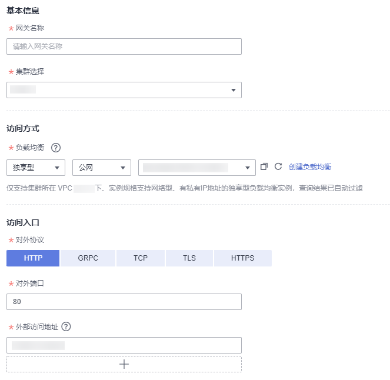
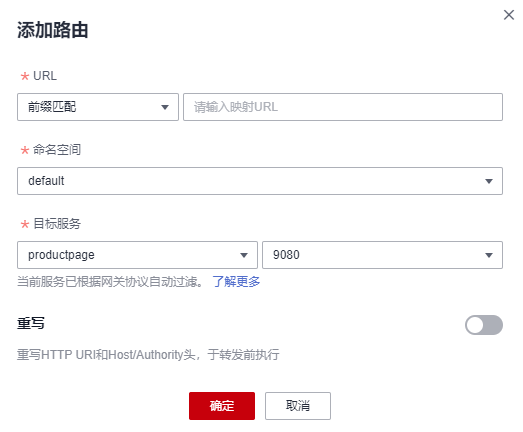
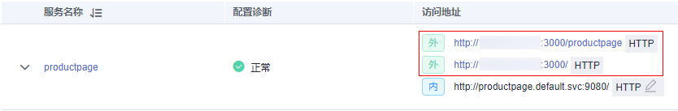

# 添加网关

服务网关在微服务实践中可以做到统一接入、流量管控、安全防护、业务隔离等功能。

## 前提条件

服务网关使用弹性负载均衡服务（ELB）的负载均衡器提供网络访问，因此在添加网关前，请提前创建负载均衡。

创建负载均衡时，需要确保所属VPC与集群的VPC一致，详情请参见[创建独享型负载均衡器](https://support.huaweicloud.com/usermanual-elb/elb_lb_000006.html)或[创建共享型负载均衡器](https://support.huaweicloud.com/usermanual-elb/zh-cn_topic_0015479967.html)。如果是独享型，实例规格需要选择“网络型（TCP/UDP）”，且网络类型需要勾选“IPv4私网”，确保负载均衡实例有私网IP地址。

## 操作步骤

1.  登录[应用服务网格控制台](https://console.huaweicloud.com/asm/?locale=zh-cn)，单击服务网格的名称，进入网格详情页面。
2.  在左侧导航栏选择“网关管理”，单击“添加网关”。
3.  配置网关参数。

    -   **网关名称**

        请输入网关的名称。由小写字母、数字和中划线（-）组成，且必须以小写字母开头，小写字母或数字结尾，长度范围为4\~59个字符。

    -   **集群选择**

        选择网关所属的集群。

    -   **访问方式**

        服务网关使用弹性负载均衡服务（ELB）的负载均衡实例提供网络访问，支持共享型和独享型规格，且支持公网和私网。如果是独享型，实例规格需要选择“网络型（TCP/UDP）”，且网络类型需要勾选“IPv4私网”，确保负载均衡实例有私网IP地址。

        负载均衡实例需与当前集群处于相同VPC。

    -   **访问入口**
        -   对外协议

            请根据业务的协议类型选择。支持HTTP、GRPC、TCP、TLS及HTTPS五种协议类型的选择。

        -   对外端口

            开放在负载均衡服务地址的端口，可任意指定。

        -   外部访问地址

            系统自动填充负载均衡实例的IP地址，作为服务访问入口地址，您也可以将其修改为负载均衡实例关联的域名。

        -   TLS终止

            对外协议为HTTPS时，TLS终止为开启状态，且不可关闭。

            对外协议为TLS时，可选择开启/关闭TLS终止。开启TLS终止时需要绑定证书，以支持TLS数据传输加密认证；关闭TLS终止时，网关将直接转发加密的TLS数据。

        -   密钥证书
            -   配置TLS协议并开启TLS时，需要绑定证书，以支持TLS数据传输加密认证。
            -   配置HTTPS协议时，需要绑定密钥证书。

        -   TLS最低版本/TLS最高版本

            配置TLS协议并开启TLS终止，或者配置HTTPS协议时，提供TLS最低版本/TLS最高版本的选择。

    **图 1**  添加网关  
    

4.  （可选）配置路由参数。

    请求的访问地址与转发规则匹配（转发规则由外部访问地址+URL组成）时，此请求将被转发到对应的目标服务处理。单击图标，弹出“添加路由”对话框。

    -   **URL匹配规则**
        -   前缀匹配：例如映射URL为/healthz，只要符合此前缀的URL均可访问。例如/healthz/v1、/healthz/v2。
        -   完全匹配：只有完全匹配上才能生效。例如映射URL为/healthz，则必须为此URL才能访问。

    -   **URL**

        服务支持的映射URL，例如/example。

    -   **命名空间**

        服务网关所在的命名空间。

    -   **目标服务**

        添加网关的服务，直接在下拉框中选择。目标服务会根据对应的网关协议进行过滤，过滤规则请参见[添加路由时，为什么选不到对应的服务？](https://support.huaweicloud.com/asm_faq/asm_faq_0035.html)。

        配置诊断失败的服务无法选择，需要先根据[手动修复项](手动修复项.md)或[自动修复项](自动修复项.md)进行修复。

    -   **访问端口**

        仅显示匹配对外协议的端口。

    -   **重写**

        （对外协议为HTTP时可配置）

        重写HTTP URI和Host/Authority头，于转发前执行。默认关闭。开启后，需要配置如下参数：

        -   URI：使用此值重写URI的路径（或前缀），如果原始URI是基于前缀匹配，那么将替换相应匹配的前缀。
        -   Host/Authority头：使用此值重写HTTP的Host/Authority头。

    **图 2**  添加路由  
    

5.  配置完成后，单击“确定“。

    网关添加完成后，可前往“服务管理”页面，获取服务外网访问地址。

    **图 3**  服务外网访问地址  
    

