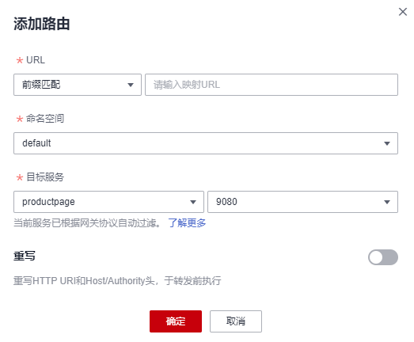

# 添加路由

## 操作场景

您可以给已创建好的网关添加多个路由，配置多个转发策略。

## 操作步骤

1.  登录[应用服务网格控制台](https://console.huaweicloud.com/asm/?locale=zh-cn)，单击服务网格的名称，进入网格详情页面。
2.  在左侧导航栏选择“网关管理”，在需要添加路由的网关所在行，单击操作列的“添加路由“，配置如下参数。

    -   **URL匹配规则**
        -   前缀匹配：例如映射URL为/healthz，只要符合此前缀的URL均可访问。例如/healthz/v1、/healthz/v2。
        -   完全匹配：只有完全匹配上才能生效。例如映射URL为/healthz，则必须为此URL才能访问。

    -   **URL**

        服务支持的映射URL，例如/example。

        > **说明：** 
        >同一网关下的URL配置不能相同。

    -   **命名空间**

        服务网关所在的命名空间。

    -   **目标服务**

        添加网关的服务，直接在下拉框中选择。目标服务会根据对应的网关协议进行过滤，过滤规则请参见[添加路由时，为什么选不到对应的服务？](https://support.huaweicloud.com/asm_faq/asm_faq_0035.html)。

        配置诊断失败的服务无法选择，需要先根据[手动修复项](手动修复项.md)或[自动修复项](自动修复项.md)进行修复。

    -   **访问端口**

        仅显示匹配对外协议的端口。

    -   **重写**

        （对外协议为HTTP时可配置）

        重写HTTP URI和Host/Authority头，于转发前执行。默认关闭。开启后，需要配置如下参数：

        -   URI：使用此值重写URI的路径（或前缀），如果原始URI是基于前缀匹配，那么将替换相应匹配的前缀。
        -   Host/Authority头：使用此值重写HTTP的Host/Authority头。

    **图 1**  添加路由  
    

3.  配置完成后，单击“确定“。

