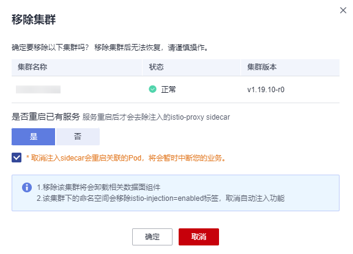
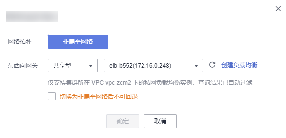

# 添加集群

企业版网格支持对多个集群进行管理，且支持服务跨集群通信。

## 约束与限制

-   目前支持v1.15、v1.17、v1.19和v1.21版本的集群加入企业版网格。
-   不支持安全容器类型的CCE Turbo集群添加至网格。
-   同一网格最多只能添加五个集群。
-   同一虚拟私有云的集群只能加入同一个网格。
-   为了满足高可用的要求，集群需要至少包含两个可用节点，每个节点至少保证有2U4G的可用资源。
-   集群的服务网段、容器网段不能和网格内已有集群的服务网段、容器网段冲突。如果集群和网格内的已有集群处于不同的VPC，集群的子网网段也不能冲突。
-   如果实例（Pod）需要跨集群通信，集群需要使用ENI网络模型，且集群之间网络互通，可以处于同一VPC内，也可以将多个集群的VPC通过其他方式（对等连接、云连接等）连通。网络连通请参见[如何通过对等连接打通两个集群的VPC网络，实现实例跨集群通信？](https://support.huaweicloud.com/asm_faq/asm_faq_0033.html)。
-   CCE集群和CCE Turbo集群混合多集群场景，CCE集群服务访问Turbo集群服务时，需要为Turbo集群的ENI安全组入方向放通CCE集群的容器网段，否则会访问不通。具体操作请参见[CCE集群服务访问CCE Turbo集群服务时，如何配置安全组规则？](https://support.huaweicloud.com/asm_faq/asm_faq_0038.html)。

## 操作步骤

1.  登录[应用服务网格控制台](https://console.huaweicloud.com/asm/?locale=zh-cn)，使用以下任意一种方式进入添加集群页面。
    -   （快捷方式）在企业版网格右上方，单击图标。
    -   在企业版网格详情页，单击左侧导航栏的“网格配置”，在“基本信息”页签单击“添加集群”。

2.  设置集群信息。
    -   **集群配置**

        在集群列表中选择集群，或在列表右上角输入集群名称搜索需要的集群。勾选后，系统自动校验集群是否符合添加要求，若校验不通过，会以图标标识，鼠标放上去可以查看校验不通过的原因以及解决方案。具体内容可参考[集群校验报错常见场景及解决方案](https://support.huaweicloud.com/asm_faq/asm_faq_0034.html)。

        > **说明：** 
        >如果当前没有可用集群，需要先创建集群后，再进行添加，详情可参考[购买CCE集群](https://support.huaweicloud.com/usermanual-cce/cce_01_0028.html)。

        选择好集群后，按照集群的网络模型或实际的通信需求选择集群的网络类型（要求网格版本为1.8.4-r3及以上）。网络类型分为扁平网络和非扁平网络，如果是非扁平网络，还要为集群配置一个东西向流量的私网ELB，作为其他集群的访问入口。

        > **说明：** 
        >关于扁平网络和非扁平网络的介绍以及如何选型请参见[扁平网络和非扁平网络](扁平网络和非扁平网络.md)；选择非扁平网络时，如果查询不到ELB，请参考[企业版网格添加集群时，选择非扁平网络，为什么查询不到ELB？](https://support.huaweicloud.com/asm_faq/asm_faq_0032.html)进行排查。

    -   **sidecar配置**
        -   选择命名空间：为命名空间设置标签istio-injection=enabled，其中的Pod在重启后会自动注入istio-proxy sidecar。
        -   是否重启已有服务：如果开启（即重启已有服务），会自动注入istio-proxy sidecar，业务将会暂时中断。

    -   **可观测性配置**

        继承自网格配置，不可修改。

3.  设置完成后，单击“确定”。

    添加集群大约需要一分钟，请耐心等待。添加完成后，返回网格详情页面可查看到添加的集群信息。

## 相关操作

-   移除集群

    在集群所在行单击“移除”，选择重启已有服务，服务重启后会去除注入的istio-proxy sidecar。

    **图 1**  移除集群  
    

-   扁平网络切换为非扁平网络

    如果是扁平网络，支持切换网络拓扑，将扁平集群切换为非扁平。操作方法如下：

    单击扁平网络后的图标，弹出[图2](#fig2264152604316)所示窗口，为集群选择一个独享或共享型私网ELB实例，作为其他集群的访问入口。

    **图 2**  切换网络拓扑  
    

