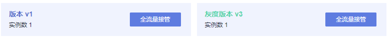

# 灰度任务基本操作

## 使用说明

对灰度版本的相关操作，其原理是修改Istio的DestinationRule和VirtualService两个资源的配置信息。修改完成后，需要等待10秒左右，新的策略规则才会生效。

## 修改灰度版本的流量策略

**修改基于流量比例的策略**

选择基于流量比例的策略时，一般会逐步加大灰度版本的流量配比，这样可以避免直接切换带来的业务风险。修改流量配比的方法如下：

1.  登录[应用服务网格控制台](https://console.huaweicloud.com/asm/?locale=zh-cn)，单击服务网格的名称，进入网格详情页面。
2.  在左侧导航栏选择“灰度发布”，单击金丝雀发布任务的名称。
3.  在“配置流量策略“页面，重新输入灰度版本的流量配比。

    假设将灰度版本流量配比调整至x，那么原版本的流量配比自动调整为100-x。

4.  单击“策略下发”。

**修改基于请求内容的策略**

目前支持基于Cookie内容、自定义Header、Query、操作系统和浏览器的规则约束，只有满足规则约束的流量才可访问到灰度版本。实际应用时，可能会多次修改规则，从而充分验证灰度版本运行效果。

1.  登录[应用服务网格控制台](https://console.huaweicloud.com/asm/?locale=zh-cn)，单击服务网格的名称，进入网格详情页面。
2.  在左侧导航栏选择“灰度发布”，单击金丝雀发布任务的名称。
3.  在“配置流量策略“页面，重新配置Cookie内容、自定义Header、Query、允许访问的操作系统或允许访问的浏览器。
4.  单击“策略下发”。

## 切换灰度策略类型

您可以在“基于请求内容“和“基于流量比例“的策略之间切换。策略完成切换后，原本配置的规则将全部失效，所有的流量会根据配置的新策略重新分配。

> **须知：** 
>只有状态为“运行中”的任务才支持流量策略变更，版本发布完成后（即新版本完全接管旧版本流量，且旧版本已下线），将不支持重新配置流量策略。

1.  登录[应用服务网格控制台](https://console.huaweicloud.com/asm/?locale=zh-cn)，单击服务网格的名称，进入网格详情页面。
2.  在左侧导航栏选择“灰度发布”，单击金丝雀发布任务的名称。
3.  在“配置流量策略“页面，切换策略类型。
4.  单击“策略下发”。

## 全流量接管

执行原版本或灰度版本后的“全流量接管“，原版本或灰度版本将接管全部流量。

1.  登录[应用服务网格控制台](https://console.huaweicloud.com/asm/?locale=zh-cn)，单击服务网格的名称，进入网格详情页面。
2.  在左侧导航栏选择“灰度发布”，单击灰度发布任务的名称。
3.  在“监测与处理”页面，单击版本后的“全流量接管”。

    **图 1**  全流量接管  
    

4.  在弹出的“全流量接管”窗口单击“确定”，此版本即可接管全部流量。

## 结束灰度任务

当新创建的灰度版本接管全部流量后，您可以选择结束灰度任务。结束灰度任务将下线原版本，其中包含的工作负载和Istio相关配置资源会全部删除。

1.  登录[应用服务网格控制台](https://console.huaweicloud.com/asm/?locale=zh-cn)，单击服务网格的名称，进入网格详情页面。
2.  在左侧导航栏选择“灰度发布”，单击灰度发布任务的名称。
3.  在“监测与处理”页面，单击灰度版本后的“全流量接管”。
4.  单击右下角“结束灰度任务”。
5.  在弹出的“结束灰度任务”窗口单击“确定”。

    结束的灰度任务可以前往“已结束灰度任务”页签查看，状态显示为“发布成功”。

## 取消灰度任务

当原版本接管全部流量后，您可以选择取消灰度任务。

1.  登录[应用服务网格控制台](https://console.huaweicloud.com/asm/?locale=zh-cn)，单击服务网格的名称，进入网格详情页面。
2.  在左侧导航栏选择“灰度发布”，单击灰度发布任务的名称。
3.  在“监测与处理”页面，单击原版本后的“全流量接管”。
4.  单击右下角“取消灰度任务”。也可以在灰度任务列表，单击任务右上角的图标。
5.  在弹出的“取消灰度任务”窗口单击“确定”。

    取消的灰度任务可以前往“已结束灰度任务”页签查看，状态显示为“发布取消”。

## 查看已结束灰度任务

取消的灰度任务，以及结束的灰度任务均可在“已结束灰度任务”页签查看。

1.  登录[应用服务网格控制台](https://console.huaweicloud.com/asm/?locale=zh-cn)，单击服务网格的名称，进入网格详情页面。
2.  在左侧导航栏选择“灰度发布”，单击“已结束灰度任务”页签。

    您可以查看：发布任务名称、发布结果、服务、发布时间，还可以删除已结束的灰度任务。

