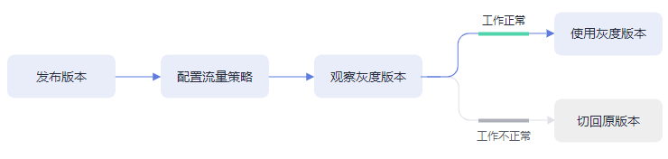

# 灰度发布概述

应用程序升级面临最大挑战是新旧业务切换，将软件从测试的最后阶段带到生产环境，同时要保证系统不间断提供服务。如果直接将某版本上线发布给全部用户，一旦遇到线上事故（或BUG），对用户的影响极大，解决问题周期较长，甚至有时不得不回滚到前一版本，严重影响了用户体验。

长期以来，业务升级逐渐形成了几个发布策略：金丝雀发布、蓝绿发布、A/B测试、滚动升级以及分批暂停发布，尽可能避免因发布导致的流量丢失或服务不可用问题。ASM当前支持金丝雀发布和蓝绿发布两种发布方式。

## 金丝雀发布

又称灰度发布，是版本升级平滑过渡的一种方式，当版本升级时，使部分用户使用新版本，其他用户继续使用老版本，待新版本稳定后，逐步扩大范围把所有用户流量都迁移到新版本上面来。这样可以最大限度地控制新版本发布带来的业务风险，降低故障带来的影响面，同时支持快速回滚。

**图 1**  金丝雀发布流程  

## 蓝绿发布

蓝绿发布提供了一种零宕机的部署方式，是一种以可预测的方式发布应用的技术，目的是减少发布过程中服务停止的时间。在保留老版本的同时部署新版本，将两个版本同时在线，新版本和老版本相互热备，通过切换路由权重的方式（非0即100）实现应用的不同版本上线或者下线，如果有问题可以快速地回滚到老版本。

**图 2**  蓝绿发布流程  

