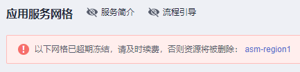
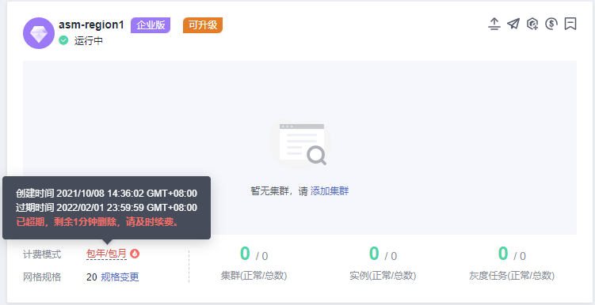
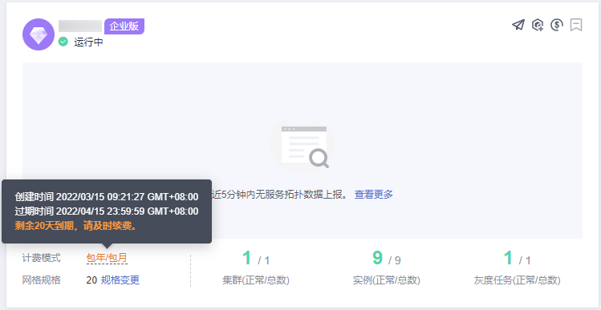

# 续费网格

## 操作场景

包年/包月的网格如果即将到期或已经超期，需要及时续费避免网格被删除而影响业务。建议您开通自动续费功能。

## 操作步骤

1.  登录[应用服务网格控制台](https://console.huaweicloud.com/asm/?locale=zh-cn)，确认网格是否需要续费。判断方法如下：

    -   列表上方是否提示已超期冻结需及时续费的网格。

        

    -   网格计费模式中是否存在已超期或即将到期提示。

        **图 1**  已超期提示  
        

        **图 2**  即将到期提示  
        

    若存在已超期或即将到期的网格，单击网格右上角的图标，进入续费页面。

2.  选择续费时长，单击“去支付”，选择支付方式后，单击“确认付款”即可成功续费。

    更多信息（自动续费、导出续费清单等）请参考[续费管理](https://support.huaweicloud.com/usermanual-billing/renewals_topic_10000000.html)。

