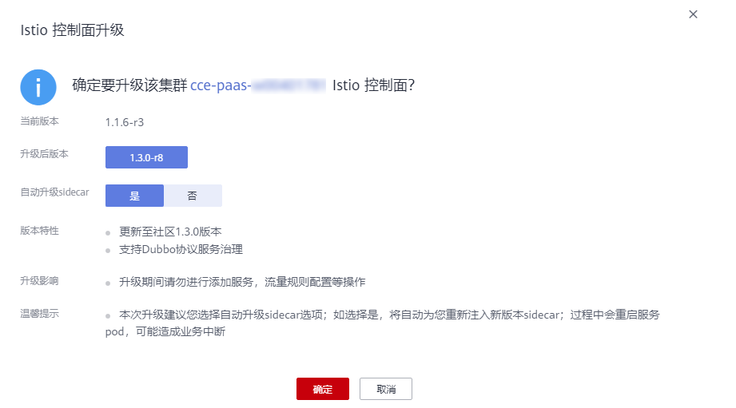
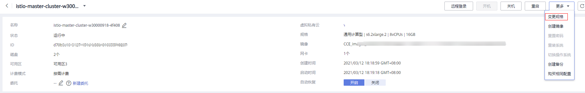
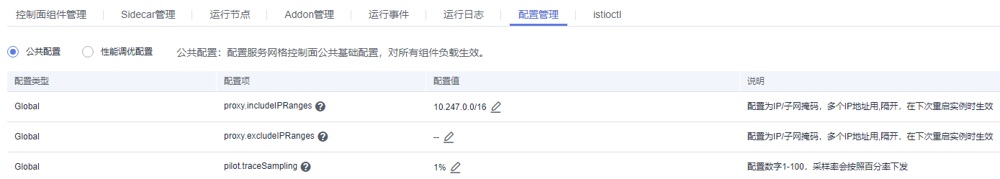
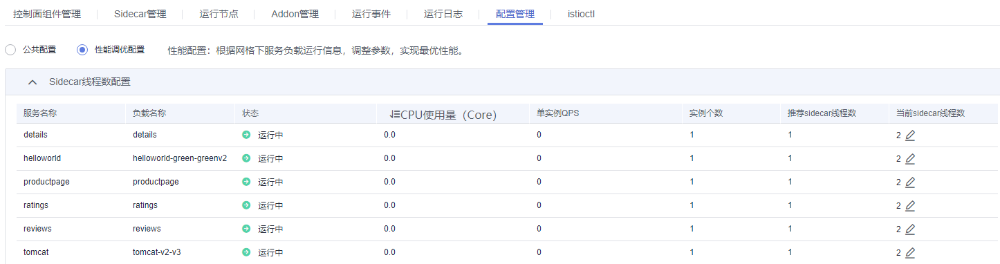

# 网格管理

网格管理提供了Istio控制面组件、数据面sidecar的健康及性能监控能力，支持运行资源的扩缩容管理，以及不同Istio版本间的升级管理。

Istio控制面组件负责向数据面组件注入sidecar，管理数据面sidecar行为，下发策略配置，搜集监控数据等。其中，sidecar（边车）是指运行在业务pod中，与业务容器协同工作，负责业务pod的路由转发，监控数据采集，流量规则配置等功能。

## 监控已启用服务网格的集群

1.  登录[应用服务网格控制台](https://console.huaweicloud.com/istio/?locale=zh-cn)，在左侧导航栏中选择“网格管理“。
2.  在右侧页面，单击服务网格名称。
3.  单击专有网格名称，查看控制面所有组件和Sidecar的业务pod信息。

    -   “控制面组件管理”页签：展示Istio控制面的所有组件，以及每个组件的运行状态，CPU、内存占用率，命名空间等信息。
    -   “边车管理”页签：展示所有注入了边车的业务pod信息，以及每个pod的名称，CPU、内存占用率，边车版本，边车升级操作入口等信息。
    -   “运行节点”页签：查看节点的相关信息，包括节点名称、状态、节点模式（独享）、可用区、私有IP地址、规格、可用CPU、可用内存。
    -   “插件管理”页签：可以对grafana、prometheus、kiali、tracing四个插件进行安装和卸载，这些插件可以帮助用户进行流量治理与监测。
    -   “运行事件”页签：记录控制面组件的kubernetes事件，帮助您快速定位Istio控制面问题。
    -   “运行日志”页签：记录控制面组件的运行日志，帮助您快速定位Istio控制面问题。
    -   “配置管理”页签：支持公共配置和性能调优配置，请根据实际需求选择。详情请参见[配置管理](#section13427952132712)。
    -   “istioctl”页签：使用Istio命令行工具配置路由策略。详情请参见[使用Istio命令行工具配置路由策略](#section1138617313614)。

    单击托管网格的名称，查看数据面所有组件和Sidecar的业务pod信息。

    -   “集群管理”页签：展示已添加的到网格中的集群信息，以及添加新的集群到网格，或移除已添加的集群。
    -   “数据面组件管理”页签：展示Istio数据面的所有组件，以及每个组件的运行状态，CPU、内存占用率，命名空间等信息。
    -   “边车管理”页签：展示所有注入了边车的业务pod信息，以及每个pod的名称，CPU、内存占用率，sidecar版本，sidecar升级操作入口等信息。
    -   “运行事件”页签：记录控制面组件的kubernetes事件，帮助您快速定位Istio控制面问题。
    -   “运行日志”页签：记录控制面组件的运行日志，帮助您快速定位Istio控制面问题。
    -   “访问控制面集群”页签：使用kubectl操作集群。详情请参见[使用kubectl操作集群](#section1982682792919)。

## 升级Istio控制面

执行升级操作需具备以下两个条件：

-   Istio控制面运行版本需小于最新版本。
-   旧版本Istio控制面运行正常。

1.  登录[应用服务网格控制台](https://console.huaweicloud.com/istio/?locale=zh-cn)，在左侧导航栏中选择“网格管理“。
2.  在Istio管理集群列表页面，单击待升级集群后的“操作 \> 升级”。
3.  在弹出的Isito控制面升级页面，确认升级信息无误后，单击“确认”。

    **图 1**  升级Istio控制面  
    

## 边车管理

展示所有注入了边车的业务pod信息，以及每个pod的名称，CPU、内存占用率，边车版本，边车升级操作入口等信息。

您可以在“边车管理“中进行“边车升级”，详细步骤如下：

1.  登录[应用服务网格控制台](https://console.huaweicloud.com/istio/?locale=zh-cn)，在左侧导航栏中选择“网格管理“。
2.  单击专有网格名称进入网格管理详情。
3.  在“边车管理“页签，单击“边车升级”，选择组件进行边车升级。

    > **须知：** 
    >-   对于单实例组件，升级会触发流量短暂中断，建议扩容后再升级。
    >-   仅专有网格支持边车升级，托管网格会随着网格版本的升级自动升级边车。

## 运行节点

“运行节点“可以帮助您查看已创建的节点。您在当前集群中创建了节点，就可以在“运行节点“页中查看节点的相关信息，包括节点名称、状态、节点模式（独享）、可用区、私有IP地址、规格、可用CPU、可用内存。

您还可以在“运行节点“中对节点进行“扩容“，详细步骤如下：

1.  登录[应用服务网格控制台](https://console.huaweicloud.com/istio/?locale=zh-cn)，在左侧导航栏中选择“网格管理“。
2.  单击专有网格名称进入网格管理详情。
3.  在“运行节点“页签，单击“操作“下的“扩容“链接跳转到弹性云服务器页面。
4.  根据节点“名称/ID“找到对应的云服务器，单击“变更规格“，即可对节点进行扩容操作。

    **图 2**  变更规格  
    

## 插件管理

插件管理可以对grafana、prometheus、kiali、tracing四个插件进行安装和卸载，这些插件可以帮助用户进行流量治理与监测。详细步骤如下：

1.  登录[应用服务网格控制台](https://console.huaweicloud.com/istio/?locale=zh-cn)，在左侧导航栏中选择“网格管理“。
2.  单击专有网格名称进入网格管理详情。
3.  在“插件管理“页签，单击待安装插件下方的“安装“，跳转到安装页面。
4.  在安装页面，选择插件要绑定的“弹性负载“，输入要分配给插件安装的“CPU配额“和“内存配额“。

    > **说明：** 
    >-   当前服务网格支持“经典型负载均衡“和“增强型弹性负载均衡“，为了更好地与服务网格配合，推荐创建并使用“增强型弹性负载均衡“。
    >-   如果您的弹性负载均衡监听器配额不足将不会显示在负载均衡器列表中。
    >-   CPU配额和内存配额中的“申请“和“限制“值为必填，且不能超过节点剩余额度。
    >-   安装grafana、prometheus、kiali和tracing插件时，界面会自动过滤掉未绑定弹性IP的负载均衡器。
    >-   不支持在IE浏览器上使用kiali插件。

5.  单击“安装“，跳转到插件管理页面，在插件卡片的左上角显示插件的安装和运行状态。如果插件长时间处于安装中状态或者安装失败状态，请删除以后重新安装。

    > **说明：** 
    >如果无需使用该插件，单击插件卡片右上角的“删除“进行卸载。

## 使用Istio命令行工具配置路由策略

使用Istio命令行工具可以配置多种路由策略管理服务流量，包括流量转移、故障注入、限流熔断等。

1.  登录[应用服务网格控制台](https://console.huaweicloud.com/istio/?locale=zh-cn)，在左侧导航栏中选择“网格管理“。
2.  单击专有网格名称进入网格管理详情。
3.  在“istioctl”页签，参照界面提示完成对应配置。

    

## 配置管理

1.  登录[应用服务网格控制台](https://console.huaweicloud.com/istio/?locale=zh-cn)，在左侧导航栏中选择“网格管理“。
2.  单击专有网格名称进入网格管理详情。
3.  在“配置管理“页签，根据实际需求进行如下配置。
    -   公共配置：配置服务网格控制面公共基础配置，对所有组件负载生效。

        

    -   性能调优配置：根据网格下服务负载运行信息，调整参数，实现最优性能。

        

## 使用kubectl操作集群

您需要先下载kubectl以及配置文件，拷贝到您的客户端机器，完成配置后，即可以使用访问kubernetes集群。

1.  登录[应用服务网格控制台](https://console.huaweicloud.com/istio/?locale=zh-cn)，在左侧导航栏中选择“网格管理“。
2.  单击托管网格名称进入网格管理详情。
3.  在“访问控制面群”页签，参照界面提示完成对应配置。

