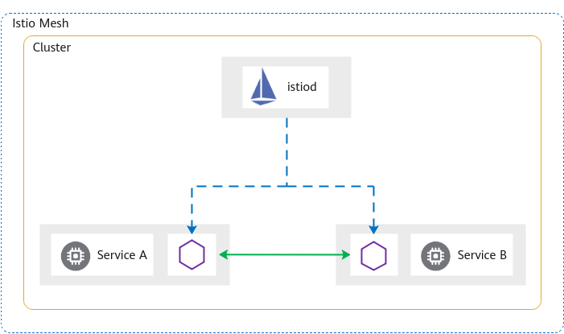
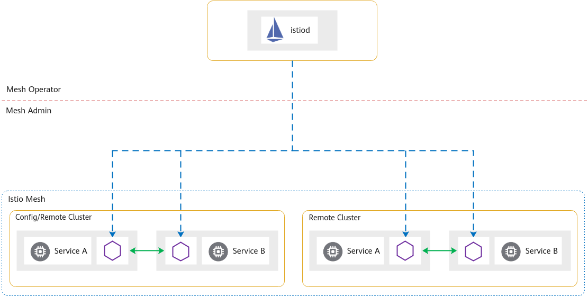
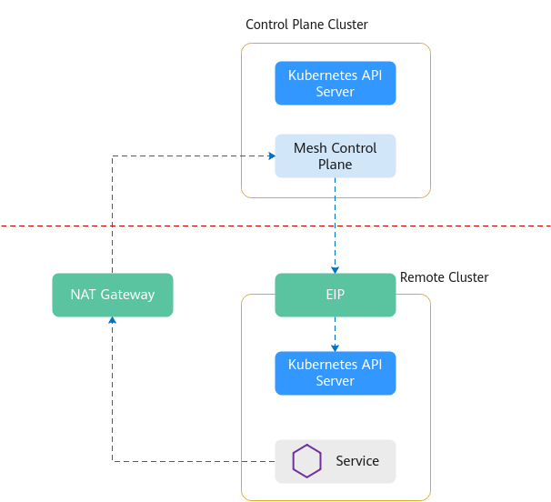
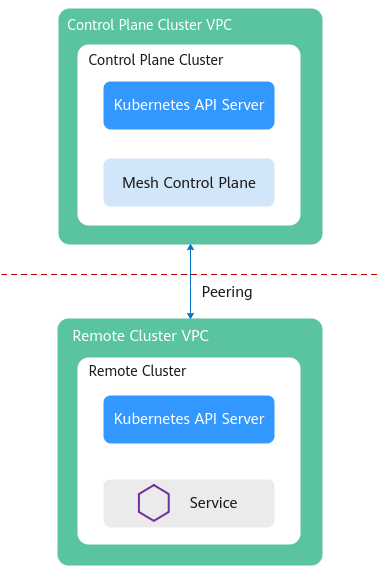
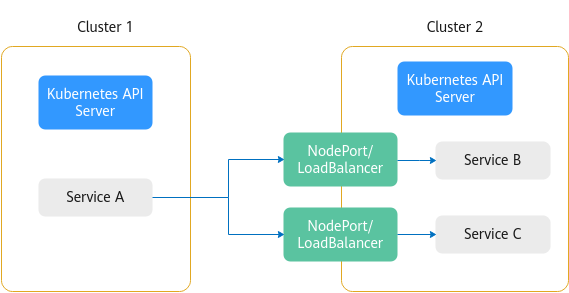
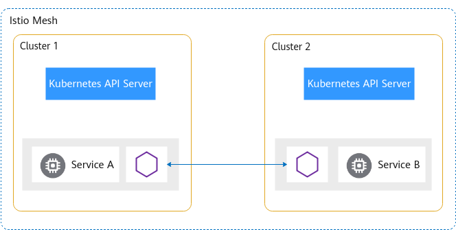

# 网格类型概述

ASM支持创建两种类型的网格，分别为基础版网格和企业版网格，两者主要区别在于网格控制面相关组件的部署模式。基础版网格的控制面组件安装在用户集群，企业版网格将控制面组件从用户集群中分离，由华为云管理和维护，简化了用户的运维负担和资源消耗，二者在具体功能上的差异请参见[基础版、企业版及社区开源版本对比](基础版-企业版及社区开源版本对比.md)。推荐您使用企业版网格进行服务管理，本文也将着重介绍企业版网格的部署架构和工作原理。

## 基础版网格

在用户集群中安装网格的控制面组件，对集群内的服务进行非侵入式的治理、遥测和安全等管理。支持Istio 1.8和1.13，只能够对一个集群进行管理，且最大管理实例数为200。

如[图1](#fig103612342176)所示，istiod是网格的控制面组件，它被部署在用户集群中，管理其他服务的Envoy组件。这是Istio传统的部署形式。

**图 1**  基础版网格  

## 企业版网格

企业版将网格的控制面组件从用户集群中分离，部署到一个独立的控制面集群中，简化了用户运维负担和资源消耗，用户只需要基于网格进行服务管理。企业版还能够对 N（N\>=1）个集群进行管理，支持服务跨集群通信。

**图 2**  企业版网格  

如[图2](#fig14863164941320)所示，istiod是网格的控制面组件，它被部署到一个独立的控制面集群中，能够同时管理多个集群的Envoy组件。

## 企业版网格工作原理

企业版网格是如何管理用户集群的，这要从用户集群和网格控制面的连接方式说起。企业版网格支持用户集群通过公网连接和私网连接两种方式连接网格控制面。

-   **公网连接主要用于跨Region添加集群或对接其他云厂商的集群**

    通过公网连接网格控制面，用户需要为集群绑定弹性公网IP（EIP），因为网格的控制面需要访问用户集群的Kubernetes API Server服务。还需要为集群所在的VPC创建公网NAT网关，因为服务的Envoy组件需要通过NAT网关连接网格的控制面。

    **图 3**  公网连接网格控制面  
    

-   **私网连接用于对接华为云Region内部的集群**

    私网连接网格控制面则是利用VPC间的对等连接功能，打通了不同VPC之间的网络隔离。在创建网格时，要提前规划网格控制面的网段。

    **图 4**  私网连接网格控制面  
    

下面要讲一下企业版网格的多集群治理能力。

传统的服务跨集群访问，用户需要创建NodePort或LoadBalancer服务，绑定ELB，配置转发端口，而且对每一个需要跨集群访问的服务都要执行此操作。除此之外，用户还需要维护各个服务的对外访问配置。

**图 5**  传统跨集群访问  

ASM企业版网格提供的服务跨集群访问能力，不需要用户进行复杂的配置，只需要将集群添加到网格，网格管理的所有集群的所有服务之间都是能够相互访问的，不管服务属于哪个集群。

**图 6**  ASM跨集群访问  

企业版网格所管理的用户集群，根据他们的网络类型，可以区分为扁平网络和非扁平网络，二者在使用上有一些差异，详细介绍请参见[扁平网络和非扁平网络](扁平网络和非扁平网络.md)。

