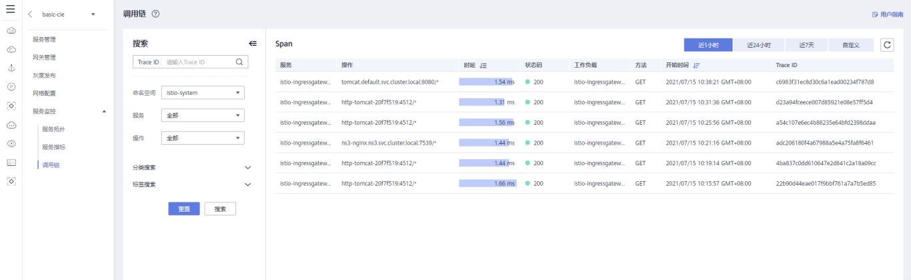

# 调用链

调用链展示可视化的服务调用执行轨迹和状态，协助性能及故障快速定界。

## 查看调用链

1.  登录管理控制台。
2.  选择已创建好对接CIE服务的网格。
3.  在左侧导航栏，单击“服务监控 \> 调用链”。
4.  通过命名空间、服务、操作、分类搜索或标签搜索进行精准搜索，可从近1小时、近1天、近一周或自定义时间维度，查看调用链。

    

    更多关于调用链的信息请参见[https://istio.io/docs/tasks/telemetry/distributed-tracing/](https://istio.io/docs/tasks/telemetry/distributed-tracing/)。

