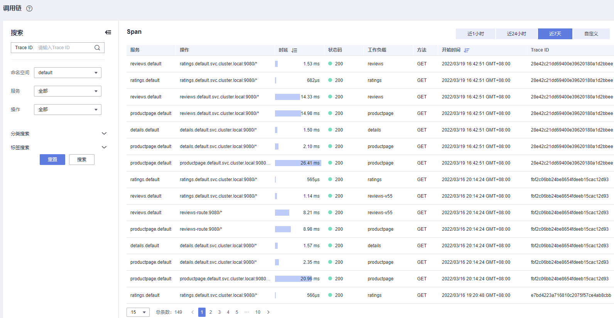
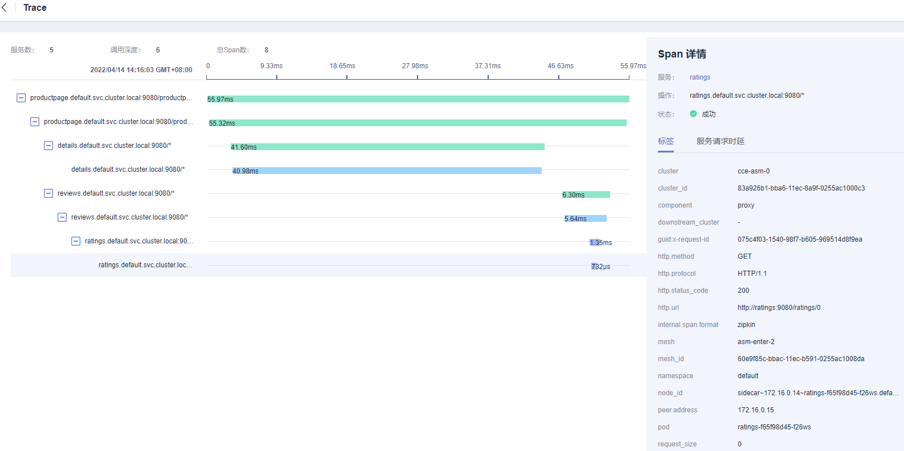

# 调用链

调用链为应用开发者提供业务调用的链路还原，以图形化展示业务调用过程中的每个环节，帮助您快速进行分布式应用的性能分析和故障诊断。

## 查看调用链

1.  登录[应用服务网格控制台](https://console.huaweicloud.com/asm/?locale=zh-cn)，选择已对接CIE服务的网格。
2.  在左侧导航栏，单击“服务监控 \> 调用链”。
3.  通过命名空间、服务、操作、分类搜索或标签搜索进行精准搜索，可从近1小时、近24小时、近7天或自定义时间维度，查看调用链。

    **图 1**  调用链  
    

4.  进入一条调用链详情页面，可以查看更加详细的调用链信息。例如调用链包含的服务数、调用深度、调用耗时，服务的状态、所在集群、所属网格等。

    **图 2**  调用链详情  
    

    更多关于调用链的信息请参见[https://istio.io/docs/tasks/telemetry/distributed-tracing/](https://istio.io/docs/tasks/telemetry/distributed-tracing/)。

