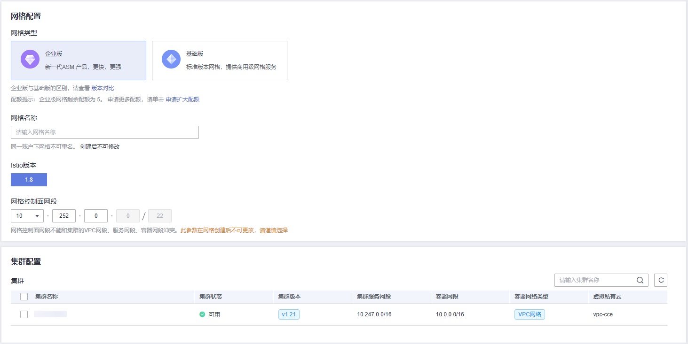

# 购买企业版网格

企业版网格的控制面完全托管，简化了用户运维负担和资源消耗，用户只需要基于网格进行服务管理即可。企业版网格支持多集群和多种基础设施的服务统一管理，包括跨集群灰度发布、服务治理、安全和拓扑。

## 前提条件

已创建CCE集群，如果未创建，请参照[购买CCE集群](https://support.huaweicloud.com/usermanual-cce/cce_01_0028.html)创建。

## 约束与限制

-   应用服务网格依赖集群CoreDNS的域名解析能力，请确保集群拥有足够资源，且CoreDNS插件运行正常。
-   集群启用Istio时，需要开通node节点（计算节点/工作节点）所在安全组的入方向7443端口规则，用于Sidecar自动注入回调。如果您使用CCE创建的默认安全组，此端口会自动开通。如果您自建安全组规则，请手动开通7443端口，以确保Istio自动注入功能正常。

## 操作步骤

1.  登录[应用服务网格控制台](https://console.huaweicloud.com/asm/?locale=zh-cn)，按以下说明进入购买网格页面。
    -   如果还未创建过网格，请单击ASM企业版中的“创建网格”。
    -   如果当前已有网格，请在网格列表页面右上角单击“购买网格”。

2.  网格类型选择“企业版”。

    企业版网格有配额限制，界面会提示当前剩余配额。如需更多配额，请通过创建工单方式申请扩大配额。

3.  设置企业版网格参数。

    **图 1**  企业版网格参数  
    

    -   **网格名称**

        企业版网格的名称，取值必须以小写字母开头，由小写字母、数字、中划线（-）组成，且不能以中划线（-）结尾，长度范围为4\~64个字符。

        同一帐号下网格不可重名，且网格名称创建后不可修改。

    -   **企业项目**（可选）

        企业项目是一种云资源管理方式，[企业项目管理](https://console.huaweicloud.com/eps/)提供统一的云资源按项目管理，以及项目内的资源管理、成员管理。

        如需使用企业项目，帐号必须为企业实名认证，且已开通企业项目。更多信息请参见[如何开通企业项目](https://support.huaweicloud.com/usermanual-em/pm_topic_0002.html)。

    -   **代理模式**

        代理模式可选sidecar-proxy和node-proxy。node-proxy目前公测免费，支持5000实例的网格规模。二者区别请参考[代理模式](代理模式.md)。

    -   **Istio版本**

        企业版网格支持的Istio版本。

    -   **网格控制面网段**

        > **说明：** 
        >此参数在网格创建后不可更改，请谨慎选择。

        此网段为ASM内部使用网段。若待加入集群通过公网接入，选择默认网段即可；如需打通待加入集群与ASM网络，通过专线接入，则需要设置此网段，避免和集群中使用网段冲突。

        -   ASM网段的掩码固定为22位。推荐使用子网10.253.0.0/22、172.31.0.0/22。
        -   ASM网段应避免与这些网段冲突：
            -   枢纽私有云所使用的网段。
            -   通过非公网方式接入的集群所使用的网段，包括但不限于容器网段、服务网段、集群Node节点网段。

        -   建议从10.2.0.0/16\~10.246.0.0/16、10.248.0.0/16\~10.255.0.0/16、172.17.0.0/16\~172.31.0.0/16覆盖范围中选取一个掩码为22的子网。
        -   不推荐使用192.168.0.0/16、172.16.0.0/16、10.0.0.0/16、10.1.0.0/16、10.247.0.0/16覆盖范围内的22位掩码子网（极易与用户集群环境中网段冲突）。

    -   **集群配置**

        在集群列表中选择集群，或在列表右上角输入集群名称搜索需要的集群。仅可选择当前网格版本支持的集群版本，并且至少选择一个集群。

        勾选后，系统自动校验集群是否符合添加要求，若校验不通过，会以图标标识，鼠标放上去可以查看校验不通过的原因以及解决方案。具体内容可参考[集群校验报错常见场景及解决方案](https://support.huaweicloud.com/asm_faq/asm_faq_0034.html)。

        选择好集群后，按照集群的网络模型或实际的通信需求选择集群的网络类型（要求网格版本为1.8.4-r3及以上）。网络类型分为扁平网络和非扁平网络，如果是非扁平网络，还要为集群配置一个东西向流量的私网ELB，作为其他集群的访问入口。

        > **说明：** 
        >关于扁平网络和非扁平网络的介绍以及如何选型请参见[扁平网络和非扁平网络](扁平网络和非扁平网络.md)；选择非扁平网络时，如果查询不到ELB，请参考[企业版网格添加集群时，选择非扁平网络，为什么查询不到ELB？](https://support.huaweicloud.com/asm_faq/asm_faq_0032.html)进行排查。

4.  （可选）高级配置。
    -   **sidecar配置**

        （代理模式选择sidecar-proxy时可配置）

        选择命名空间，为命名空间设置标签istio-injection=enabled，其中的Pod在重启后会自动注入istio-proxy sidecar。

        如果不进行sidecar配置，可在网格创建成功后在“网格配置 \> sidecar管理”中注入sidecar。具体操作请参考[sidecar注入](sidecar管理.md#section65931513505)。

        **是否重启已有服务**

        ：会重启命名空间下已有服务关联的Pod，将会暂时中断业务。只有在重启后，已有服务关联的Pod才会自动注入istio-proxy sidecar。

        ：已有服务关联的Pod不会自动注入istio-proxy sidecar，需要在CCE控制台，手动重启工作负载才会注入sidecar。

        > **须知：** 
        >建议您选择重启已有服务，如果不重启，会引起如下异常：当前网格卸载后，所选集群重新启用网格的情况下，网关访问会失败。

    -   **大规格实例优化**

        （代理模式选择sidecar-proxy时可配置，仅在“华东-上海一”区域开放）

        启用Mantis插件：开启后，ASM将会在您的集群内安装Mantis插件，默认高可用部署（即2个实例），以此降低大规格场景下Proxy带来的内存开销。

        如内部服务有访问外部服务的需求，需要为集群所在VPC子网配置NAT网关。具体操作请参见[购买公网NAT网关](https://support.huaweicloud.com/usermanual-natgateway/zh-cn_topic_0150270259.html)。

        关于Mantis插件的介绍及使用约束请参见[大规格实例优化](大规格实例优化.md)。

    -   **可观测性配置**

        支持对接华为云APM服务和CIE服务，二者提供了不同维度的监控能力，详细介绍请参见[流量监控](流量监控.md)和[服务监控](服务监控.md)。

        若选择对接CIE，需要选择一个CIE实例及已接入CIE的子网，并且请确保所选集群已安装cie-collector插件。

        > **说明：** 
        >若代理模式选择node-proxy，则可观测性配置只能选择对接CIE。

5.  设置完成后，在页面右侧配置清单选择计费模式、网格规模以及购买时长。

    > **说明：** 
    >node-proxy目前公测免费，若代理模式选择node-proxy，则无需执行此步骤。

    -   **网格计费**

        支持“按需计费“和“包年/包月“模式。

        -   包年/包月是预付费模式，按订单的购买周期计费，适用于可预估资源使用周期的场景，价格比按需计费模式更优惠。

            包年/包月网格创建后不能卸载，如需停止使用，请到“费用中心”执行退订操作。

        -   按需计费是后付费模式，按资源的实际使用时长计费，可以随时开通/删除资源。计费规则如下：

            购买成功后即开始计费；治理不足20实例时，按20实例数收取费用，超过20实例时，按实际实例数收取费用。

            > **说明：** 
            >选择按需计费时，网格规模默认为5000实例。

    -   **网格规模**

        企业版网格支持管理的最大Pod实例数量，请根据业务需求选择。如需支持5000实例以上，请[提交工单](https://console.huaweicloud.com/ticket/?&locale=zh-cn#/ticketindex/createIndex)申请。

    -   **购买时长**

        仅包年/包月计费模式需要设置。选择的购买时长越长，价格越优惠，如果您长期使用，建议购买1年。

    -   **自动续费**

        选择“包年/包月”的计费模式后，系统会默认开启自动续费模式，您可选择关闭自动续费。

        按月购买，自动续费周期为1个月；按年购买，自动续费周期为1年。例如，购买时长为3个月，开启自动续费，包周期到期后，系统会自动为您购买1个月。

6.  设置完成并确认信息无误，如果选择“包年/包月”，单击“去支付”，按界面指导完成付款操作；如果选择“按需计费”，单击“提交”。

    网格创建大约需要5\~10分钟，系统会自动完成以下操作：检查资源配额、创建虚拟私有云、创建弹性负载均衡、创建网格访问路由、创建NAT网关、创建网格运行环境、安装网格组件。

    > **说明：** 
    >启用网格期间会操作如下资源：
    >-   创建一个Helm应用编排release对象，作为Istio控制面的资源。
    >-   开通ECS节点的安全组，允许7443端口的入流量，使其支持对Pod进行sidecar自动注入。

7.  查看企业版网格是否创建成功。

    在应用服务网格控制台，如果网格状态为“运行中”表明企业版网格创建成功。

    **图 2**  企业版网格  
    

