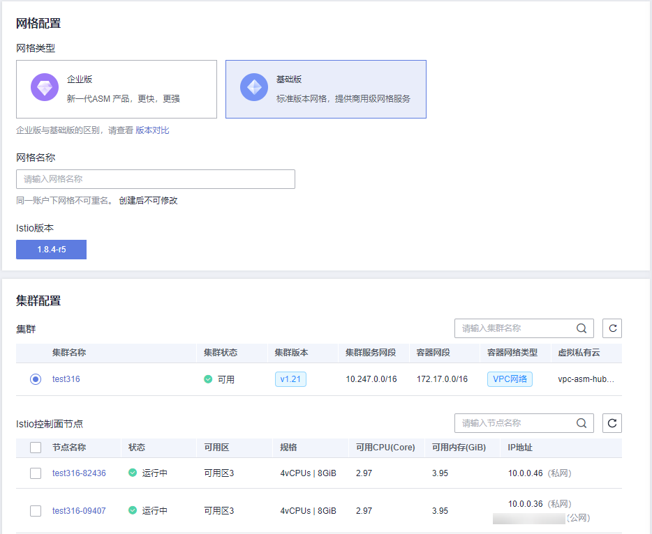

# 购买基础版网格

基础版网格的控制面组件安装在用户集群，用户需要自行管理和维护集群内的控制面组件。

## 前提条件

已创建CCE集群，如果未创建，请参照[购买CCE集群](https://support.huaweicloud.com/usermanual-cce/cce_01_0028.html)创建。

## 约束与限制

-   应用服务网格依赖集群CoreDNS的域名解析能力，请确保集群拥有足够资源，且CoreDNS插件运行正常。
-   集群启用Istio时，需要开通node节点（计算节点/工作节点）所在安全组的入方向7443端口规则，用于Sidecar自动注入回调。如果您使用CCE创建的默认安全组，此端口会自动开通。如果您自建安全组规则，请手动开通7443端口，以确保Istio自动注入功能正常。

## 操作步骤

1.  登录[应用服务网格控制台](https://console.huaweicloud.com/asm/?locale=zh-cn)，按以下说明进入购买网格页面。
    -   如果还未创建过网格，请单击ASM基础版中的“创建网格”。
    -   如果当前已有网格，请在网格列表页面右上角单击“购买网格”。

2.  网格类型选择“基础版”。
3.  设置基础版网格参数。

    **图 1**  基础版网格参数  
    

    -   **网格名称**

        基础版网格的名称，取值必须以小写字母开头，由小写字母、数字、中划线（-）组成，且不能以中划线（-）结尾，长度范围为4\~64个字符。

        同一帐号下网格不可重名，且网格名称创建后不可修改。

    -   **企业项目**（可选）

        企业项目是一种云资源管理方式，[企业项目管理](https://console.huaweicloud.com/eps/)提供统一的云资源按项目管理，以及项目内的资源管理、成员管理。

        如需使用企业项目，帐号必须为企业实名认证，且已开通企业项目。更多信息请参见[如何开通企业项目](https://support.huaweicloud.com/usermanual-em/pm_topic_0002.html)。

    -   **Istio版本**

        基础版网格支持的Istio版本。

    -   **集群**

        在集群列表中选择集群，或在列表右上角输入集群名称搜索需要的集群。仅可选择当前网格版本支持的集群版本。

    -   **Istio控制面节点**

        基础版网格的控制面组件安装在用户集群，因此需要选择用于安装Istio控制面的节点。如果需要高可用，建议选择两个或以上不同可用区的节点。

        所选节点会被添加istio:master标签，网格组件会调度到该节点上，但可能会和用户的业务容器运行在一起，生产环境建议使用企业版网格。

4.  （可选）高级配置。
    -   **sidecar配置**

        选择命名空间，为命名空间设置标签istio-injection=enabled，其中的Pod在重启后会自动注入istio-proxy sidecar。

        如果不进行sidecar配置，可在网格创建成功后在“网格配置 \> sidecar管理”中注入sidecar。具体操作请参考[sidecar注入](sidecar管理.md#section65931513505)。

    -   **是否重启已有服务**

        ：会重启命名空间下已有服务关联的Pod，将会暂时中断业务。只有在重启后，已有服务关联的Pod才会自动注入istio-proxy sidecar。

        ：已有服务关联的Pod不会自动注入istio-proxy sidecar，需要在CCE控制台，手动重启工作负载才会注入sidecar。

        > **须知：** 
        >建议您选择重启已有服务，如果不重启，会引起如下异常：当前网格卸载后，所选集群重新启用网格的情况下，网关访问会失败。

    -   **可观测性配置**

        支持对接华为云APM服务，详细介绍请参见[流量监控](流量监控.md)。

5.  设置完成后，在页面右侧配置清单确认网格配置，确认无误后，单击“提交”。

    创建基础版网格预计需要1\~3分钟，请耐心等待。当网格状态从“安装中”变为“运行中”，表示网格创建成功。

    > **说明：** 
    >启用网格期间会操作如下资源：
    >-   创建一个Helm应用编排release对象，作为服务网格控制面的资源。
    >-   开通节点的安全组，允许7443端口的入流量，使其支持对Pod进行自动注入。

