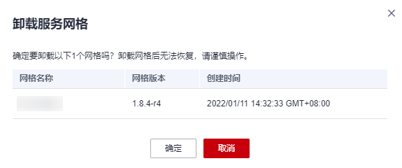
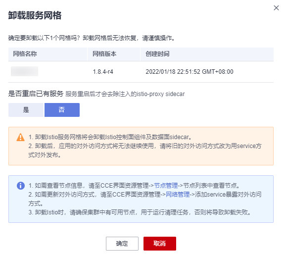

# 退订与卸载

## 操作场景

当网格不再需要时，可以将其删除，避免继续产生费用。

-   包年/包月网格采用退订方式删除，请参考[退订网格](#zh-cn_topic_0000001233246629_section4596211134016)。
-   按需计费或免费网格采用卸载方式删除，请参考[卸载网格](#zh-cn_topic_0000001233246629_section7239114110418)。

对于包年/包月网格，即使集群已被删除，服务网格仍然会继续计费，如果网格不再使用，请将其退订。

## 约束与限制

-   企业版网格需移除全部集群后，才可支持卸载或退订。
-   专有版包周期网格如需删除，需要先通过退订转为基础版网格，再执行卸载操作。
-   如果网格有正在运行的灰度发布任务，请先完成灰度发布，再卸载或退订网格。
-   卸载基础版或专有版网格时，请确保集群中有可用节点，用于运行清理任务，否则将导致卸载失败。

## 退订网格

1.  登录[应用服务网格控制台](https://console.huaweicloud.com/asm/?locale=zh-cn)，在对应的包年/包月网格下单击图标，跳转至“云服务退订”页面。
2.  勾选待退订的网格，单击操作列的“退订资源”。
3.  选择或填写一个退订原因，单击“退订”。
4.  在弹出的确认页面单击“退订”。

## 卸载网格

1.  登录[应用服务网格控制台](https://console.huaweicloud.com/asm/?locale=zh-cn)，在对应的按需计费或免费网格下单击图标。
    -   如果是企业版网格，请执行[2](#zh-cn_topic_0000001233246629_li1558885018217)。
    -   如果是专有版或基础版网格，请执行[3](#zh-cn_topic_0000001233246629_li1424023724312)。

2.  在“卸载服务网格”页面，单击“确定”，卸载后将直接删除网格。

    **图 1**  卸载企业版网格  
    

3.  在“卸载服务网格”页面，选择是否重启已有服务，并阅读注意事项。

    卸载时，默认不会重启已有服务。只有在服务重启后才会去除注入的istio-poxy sidecar，如需重启，请选择“是”，重启服务将会暂时中断您的业务。

    -   卸载服务网格将会卸载Istio控制面组件及数据面sidecar。
    -   卸载后，应用的对外访问方式将无法继续使用，请将旧的对外访问方式改为用service方式对外发布。

        如需更新对外访问方式，请在CCE控制台“资源 \> 服务发现”页面创建服务暴露对外访问方式。

    -   对于专有版网格，卸载时将自动为您清理istio独享节点的相关标签，但不会删除istio-master节点，请到CCE界面删除，避免资源浪费。

        如需查看节点信息，请在CCE控制台“资源 \> 节点管理 \> 节点”页面中查看。

    **图 2**  卸载专有版或基础版网格  
    

