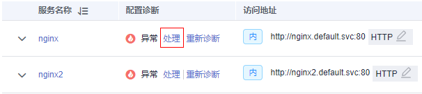
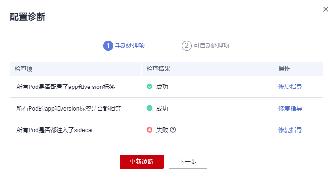
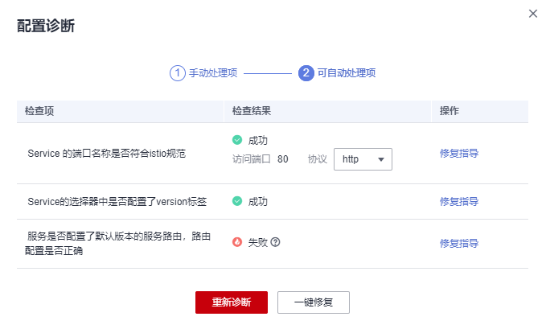

# 配置诊断

应用服务网格会对管理集群下的所有服务进行诊断，诊断结果为正常的服务，方可进行流量治理、流量监控及灰度发布等操作。

## 约束与限制

-   如果多个服务对应一个工作负载，则不允许将这些服务加入网格进行治理。
-   如果服务的工作负载使用主机网络模式（Pod配置了hostNetwork: true），则不支持注入sidecar。

## 服务诊断

1.  登录[应用服务网格控制台](https://console.huaweicloud.com/asm/?locale=zh-cn)，单击服务网格的名称，进入网格详情页面。
2.  在左侧导航栏选择“服务管理”，服务列表中展示了各服务的诊断结果。

    如果服务存在异常，请单击“处理”，根据[服务异常修复](#section104191546916)进行处理。

    **图 1**  服务诊断  
    

3.  修复异常项后，您可以单击“重新诊断”对服务进行再次诊断。

## 服务异常修复

诊断异常的服务，需要先手动修复异常状态的手动处理项，再一键修复可自动处理项。

1.  在诊断状态为异常的服务下单击“处理”，若手动处理项有异常，根据修复指导进行手动修复。

    **图 2**  手动处理项  
    

2.  手动修复异常状态的手动处理项后，单击“下一步”进入自动修复项页面，单击“一键修复”，自动处理异常状态的检查项。

    **图 3**  自动处理项  
    

    > **说明：** 
    >-   如果自动处理无法修复状态异常的检查项，请根据修复指导进行手动修复。
    >-   已配置网关或创建灰度发布的服务可能因为Service的端口名称被修改而出现异常，此时不支持进行一键修复。
    >-   如果服务未在服务列表中展示，请检查对应的工作负载是否存在。

